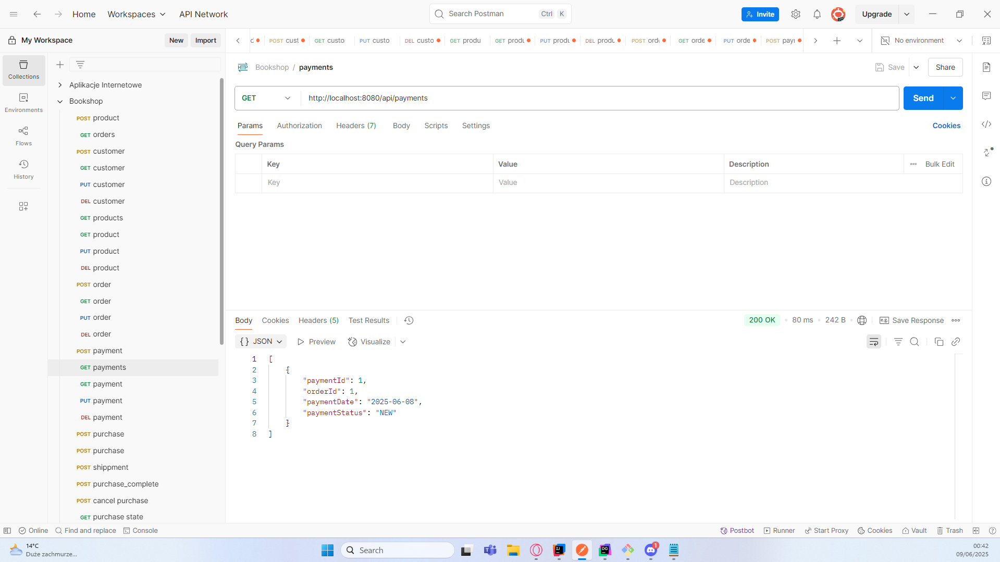
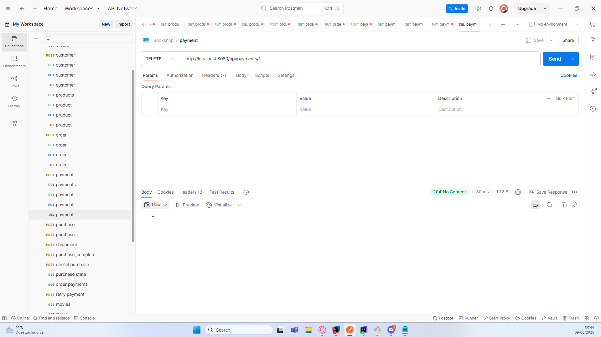
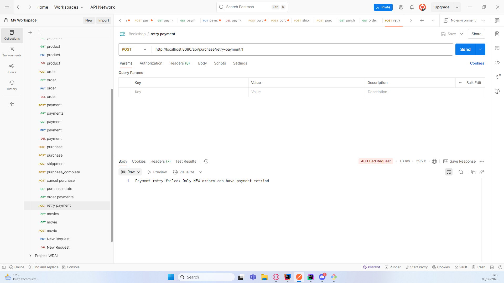

# Księgarnia internetowa

**Autorzy:** Radosław Szepielak, Kacper Wdowiak

## 1. Wybór technologii

### 1.1 Baza danych

- **Typ:** Relacyjna
- **Wybrany system:** Oracle Database
- **Uzasadnienie wyboru:** Oracle to stabilna, wydajna i szeroko wykorzystywana baza danych. Posiada dobre wsparcie dla transakcji, mechanizmów kontroli współbieżności oraz integracji z JPA/Hibernate/Spring.

### 1.2 Język i framework

- **Język programowania:** Java
- **Framework:** Spring Boot + Hibernate (JPA)
- **Uzasadnienie wyboru:** Połączenie Spring Boot i Hibernate umożliwia szybkie tworzenie aplikacji webowych i REST API z pełną obsługą ORM i transakcji.

---

## 2. Tematyka projektu

**System zarządzania księgarnią internetową**

### 2.1 Funkcjonalności

- **Operacje CRUD:** Zarządzanie produktami (książki, gry, akcesoria), klientami, zamówieniami, autorami.
- **Operacje transakcyjne:** Zakup produktu – tworzenie zamówienia z kontrolą stanu magazynowego i aktualizacją stanu produktów.
- **Operacje raportujące:** Generowanie raportu sprzedaży wg kategorii, średnia ocena produktów, liczba zamówień wg statusu.

---

## 3. Projekt bazy danych

### 3.1 Model ERD


### 3.2 Schemat bazy danych

Baza danych zawiera tabele reprezentujące produkty, klientów, zamówienia, płatności, oraz szczegóły związane z różnymi typami produktów (książki, gry, filmy, akcesoria).

#### **Główne tabele:**

- **PRODUCTS**  
  Informacje o wszystkich produktach: nazwa, cena, stan magazynowy, kategoria, ocena.

- **CATEGORIES**  
  Kategorie produktów (np. książki, gry, filmy, akcesoria).

- **BOOK_DETAILS**  
  Szczegóły książek: ISBN, rok wydania, język, liczba stron, wydawca, opis.

- **AUTHORS**  
  Dane autorów książek.

- **BOOK_AUTHORS**  
  Tabela łącząca książki z autorami (relacja wiele-do-wielu).

- **GAME_DETAILS**  
  Szczegóły gier: platforma, deweloper, rok wydania, opis.

- **MOVIE_DETAILS**  
  Szczegóły filmów: reżyser, czas trwania, język, gatunek, rok, opis.

- **ACCESSORIES_DETAILS**  
  Opisy akcesoriów (np. gadżety, dodatki).

#### **Obsługa zamówień i klientów:**

- **CUSTOMERS**  
  Dane klientów: imię, nazwisko, email, telefon, adres.

- **ORDERS**  
  Zamówienia: klient, data, status, dostawca.

- **ORDER_DETAILS**  
  Szczegóły zamówień: produkt, ilość, cena jednostkowa, rabat.

- **PAYMENTS**  
  Płatności do zamówień: data, status (NEW, PAID, FAILED).

#### **Dodatkowe tabele:**

- **PUBLISHERS**  
  Wydawcy książek.

- **SHIPPERS**  
  Firmy dostawcze.

#### **Klucze główne i relacje:**

- Większość tabel posiada klucz główny (`PRIMARY KEY`) oraz powiązania (`FOREIGN KEY`) z innymi tabelami.  
- Produkty są powiązane z kategoriami oraz szczegółami zależnymi od typu (książka, film, gra, akcesorium).  
- Zamówienia powiązane są z klientami, szczegółami zamówienia, płatnościami i dostawcami.  
- Książki mają relacje z autorami i wydawcami.

#### **Sekwencje:**

- Do automatycznego generowania identyfikatorów używane są sekwencje (`SEQUENCE`) np. `PRODUCT_SEQ`, `AUTHOR_SEQ` itd.

#### Główne operacje transakcyjne obejmują:

- **Proces zakupu** (w klasie `PurchaseService`):
  - Rozpoczęcie transakcji (`@Transactional`)
  - Blokowanie pesymistyczne produktów (`LockModeType.PESSIMISTIC_WRITE`)
  - Sprawdzenie stanu magazynowego
  - Aktualizacja ilości produktów
  - Tworzenie zamówienia i płatności
  - Obsługa wyjątków i rollback w przypadku błędów

```java
@Transactional(rollbackFor = Exception.class)
public Order purchaseProducts(PurchaseRequestDTO request) {
    // Implementacja procesu zakupu
}
```


#### Dla większości encji zaimplementowaliśmy pełny zestaw uperacji CRUD za pomocą:
- Repozytoriów Spring Data JPA (np. ProductRepository)
- Warstw serwisowych (np. ProductService)
- Kontrolerów REST (np. ProductController)

### Kluczowe funkcjonalności

**Mapowanie obiektowo-relacyjne**

- Encje JPA z adnotacjami `@Entity`, `@Table`
- Relacje: `@OneToMany`, `@ManyToOne`, `@ManyToMany`
- Klucze złożone: `@Embeddable`, `@EmbeddedId`

**Transakcje**

- Zarządzanie przez Spring za pomocą `@Transactional`
- Obsługa izolacji i propagacji transakcji
- Blokowanie pesymistyczne w celu kontroli współbieżności (Zakładamy, że konflikt dostępu
 do danych będzie występował często, więc blokujemy dane od razu na czas operacji)

**Warstwa serwisowa**

- Implementacja logiki biznesowej
- Walidacja danych
- Konwersja DTO ↔ Entity

**REST API**

- Endpointy dla wszystkich encji
- Obsługa błędów
- Walidacja żądań


## 3.3 Kod DDL
```sql
-- TABLES
-- TABLE: ACCESSORIES_DETAILS
CREATE TABLE ACCESSORIES_DETAILS (
                                     ACCESSORY_ID NUMBER NOT NULL,
                                     DESCRIPTION VARCHAR2(100) NOT NULL,
                                     CONSTRAINT ACCESSORIES_DETAILS_PK PRIMARY KEY (ACCESSORY_ID)
);

-- TABLE: AUTHORS
CREATE TABLE AUTHORS (
                         AUTHOR_ID NUMBER NOT NULL,
                         FIRST_NAME VARCHAR2(100) NOT NULL,
                         LAST_NAME VARCHAR2(100) NOT NULL,
                         BIOGRAPHY VARCHAR2(100) NOT NULL,
                         CONSTRAINT AUTHORS_PK PRIMARY KEY (AUTHOR_ID)
);

-- TABLE: BOOK_AUTHORS
CREATE TABLE BOOK_AUTHORS (
                              BOOK_ID NUMBER NOT NULL,
                              AUTHOR_ID NUMBER NOT NULL,
                              CONSTRAINT BOOK_AUTHORS_PK PRIMARY KEY (BOOK_ID, AUTHOR_ID)
);

-- TABLE: BOOK_DETAILS
CREATE TABLE BOOK_DETAILS (
                              BOOK_ID NUMBER NOT NULL,
                              ISBN VARCHAR2(20) NOT NULL,
                              PUBLICATION_YEAR NUMBER NOT NULL,
                              PUBLISHER_ID NUMBER NOT NULL,
                              LANGUAGE VARCHAR2(50) NOT NULL,
                              PAGE_COUNT NUMBER NOT NULL,
                              DESCRIPTION VARCHAR2(100) NOT NULL,
                              CONSTRAINT PAGES CHECK (PAGE_COUNT > 0),
                              CONSTRAINT YEAR CHECK (PUBLICATION_YEAR >= 1900),
                              CONSTRAINT BOOK_DETAILS_PK PRIMARY KEY (BOOK_ID)
);

-- TABLE: CATEGORIES
CREATE TABLE CATEGORIES (
                            CATEGORY_ID NUMBER NOT NULL,
                            CATEGORY_NAME VARCHAR2(50) NOT NULL,
                            CONSTRAINT CATEGORIES_PK PRIMARY KEY (CATEGORY_ID)
);

-- TABLE: CUSTOMERS
CREATE TABLE CUSTOMERS (
                           CUSTOMER_ID NUMBER NOT NULL,
                           FIRST_NAME VARCHAR2(100) NOT NULL,
                           LAST_NAME VARCHAR2(100) NOT NULL,
                           EMAIL VARCHAR2(100) NOT NULL,
                           PHONE VARCHAR2(20) NOT NULL,
                           ADDRESS VARCHAR2(200) NOT NULL,
                           CITY VARCHAR2(50) NOT NULL,
                           POSTAL_CODE VARCHAR2(10) NOT NULL,
                           COUNTRY VARCHAR2(50) NOT NULL,
                           CONSTRAINT CUSTOMERS_PK PRIMARY KEY (CUSTOMER_ID)
);

-- TABLE: GAME_DETAILS
CREATE TABLE GAME_DETAILS (
                              GAME_ID NUMBER NOT NULL,
                              PLATFORM VARCHAR2(50) NOT NULL,
                              DEVELOPER VARCHAR2(50) NOT NULL,
                              RELEASE_YEAR NUMBER NOT NULL,
                              DESCRIPTION VARCHAR2(100) NOT NULL,
                              CONSTRAINT R_YEAR CHECK (RELEASE_YEAR >= 1900),
                              CONSTRAINT GAME_DETAILS_PK PRIMARY KEY (GAME_ID)
);

-- TABLE: MOVIE_DETAILS
CREATE TABLE MOVIE_DETAILS (
                               MOVIE_ID NUMBER NOT NULL,
                               DIRECTOR VARCHAR2(100) NOT NULL,
                               DURATION_IN_MINUTES NUMBER NOT NULL,
                               RELEASE_YEAR NUMBER NOT NULL,
                               LANGUAGE VARCHAR2(50) NOT NULL,
                               GENRE VARCHAR2(50) NOT NULL,
                               DESCRIPTION VARCHAR2(100) NOT NULL,
                               CONSTRAINT TIME CHECK (DURATION_IN_MINUTES > 0),
                               CONSTRAINT MOVIE_DETAILS_PK PRIMARY KEY (MOVIE_ID)
);

-- TABLE: ORDER_DETAILS
CREATE TABLE ORDER_DETAILS (
                               ORDER_ID NUMBER NOT NULL,
                               PRODUCT_ID NUMBER NOT NULL,
                               QUANTITY NUMBER NOT NULL,
                               UNIT_PRICE NUMBER(10,2) NOT NULL,
                               DISCOUNT NUMBER(10,2) NOT NULL,
                               CONSTRAINT DISCOUNT CHECK (DISCOUNT >= 0 AND DISCOUNT <= 1),
                               CONSTRAINT ORDER_DETAILS_PK PRIMARY KEY (PRODUCT_ID, ORDER_ID)
);

-- TABLE: ORDERS
CREATE TABLE ORDERS (
                        ORDER_ID NUMBER NOT NULL,
                        CUSTOMER_ID NUMBER NOT NULL,
                        ORDER_DATE DATE NOT NULL,
                        ORDER_STATUS VARCHAR2(20) NOT NULL,
                        SHIP_VIA NUMBER,
                        CONSTRAINT ORDER_STATUS CHECK (ORDER_STATUS IN ('NEW', 'CANCELLED', 'COMPLETED', 'PROCESSING')),
                        CONSTRAINT ORDERS_PK PRIMARY KEY (ORDER_ID)
);

-- TABLE: PAYMENTS
CREATE TABLE PAYMENTS (
                          PAYMENT_ID NUMBER NOT NULL,
                          ORDER_ID NUMBER NOT NULL,
                          PAYMENT_DATE DATE NOT NULL,
                          PAYMENT_STATUS VARCHAR2(20) NOT NULL,
                          CONSTRAINT PAYMENT_STATUS CHECK (PAYMENT_STATUS IN ('NEW', 'PAID', 'FAILED')),
                          CONSTRAINT PAYMENTS_PK PRIMARY KEY (PAYMENT_ID)
);

-- TABLE: PRODUCTS
CREATE TABLE PRODUCTS (
                          PRODUCT_ID NUMBER NOT NULL,
                          PRODUCT_NAME VARCHAR2(50) NOT NULL,
                          PRICE NUMBER(10,2) NOT NULL,
                          STOCK_QUANTITY NUMBER NOT NULL,
                          CATEGORY_ID NUMBER NOT NULL,
                          RATING NUMBER(1) NOT NULL,
                          CONSTRAINT RATING CHECK (RATING BETWEEN 1 AND 5),
                          CONSTRAINT PRODUCTS_PK PRIMARY KEY (PRODUCT_ID)
);

-- TABLE: PUBLISHERS
CREATE TABLE PUBLISHERS (
                            PUBLISHER_ID NUMBER NOT NULL,
                            PUBLISHER_NAME VARCHAR2(100) NOT NULL,
                            COUNTRY VARCHAR2(50) NOT NULL,
                            CONSTRAINT PUBLISHERS_PK PRIMARY KEY (PUBLISHER_ID)
);

-- TABLE: SHIPPERS
CREATE TABLE SHIPPERS (
                          SHIPPER_ID NUMBER NOT NULL,
                          COMPANY_NAME VARCHAR2(100) NOT NULL,
                          PHONE NUMBER(20) NOT NULL,
                          CONSTRAINT SHIPPERS_PK PRIMARY KEY (SHIPPER_ID)
);

-- FOREIGN KEYS
-- REFERENCE: AUTHORS_BOOK_AUTHORS (TABLE: BOOK_AUTHORS)
ALTER TABLE BOOK_AUTHORS ADD CONSTRAINT AUTHORS_BOOK_AUTHORS
    FOREIGN KEY (AUTHOR_ID)
        REFERENCES AUTHORS (AUTHOR_ID);

-- REFERENCE: BOOK_DETAILS_BOOK_AUTHORS (TABLE: BOOK_AUTHORS)
ALTER TABLE BOOK_AUTHORS ADD CONSTRAINT BOOK_DETAILS_BOOK_AUTHORS
    FOREIGN KEY (BOOK_ID)
        REFERENCES BOOK_DETAILS (BOOK_ID);

-- REFERENCE: BOOK_DETAILS_PUBLISHERS (TABLE: BOOK_DETAILS)
ALTER TABLE BOOK_DETAILS ADD CONSTRAINT BOOK_DETAILS_PUBLISHERS
    FOREIGN KEY (PUBLISHER_ID)
        REFERENCES PUBLISHERS (PUBLISHER_ID);

ALTER TABLE BOOK_DETAILS ADD CONSTRAINT UNIQUE_ISBN UNIQUE (ISBN);

-- REFERENCE: MOVIE_DETAILS_PRODUCTS (TABLE: MOVIE_DETAILS)
ALTER TABLE MOVIE_DETAILS ADD CONSTRAINT MOVIE_DETAILS_PRODUCTS
    FOREIGN KEY (MOVIE_ID)
        REFERENCES PRODUCTS (PRODUCT_ID);

-- REFERENCE: ORDER_DETAILS_ORDERS (TABLE: ORDER_DETAILS)
ALTER TABLE ORDER_DETAILS ADD CONSTRAINT ORDER_DETAILS_ORDERS
    FOREIGN KEY (ORDER_ID)
        REFERENCES ORDERS (ORDER_ID);

-- REFERENCE: ORDERS_CUSTOMERS (TABLE: ORDERS)
ALTER TABLE ORDERS ADD CONSTRAINT ORDERS_CUSTOMERS
    FOREIGN KEY (CUSTOMER_ID)
        REFERENCES CUSTOMERS (CUSTOMER_ID);

-- REFERENCE: PAYMENTS_ORDERS (TABLE: PAYMENTS)
ALTER TABLE PAYMENTS ADD CONSTRAINT PAYMENTS_ORDERS
    FOREIGN KEY (ORDER_ID)
        REFERENCES ORDERS (ORDER_ID);

-- REFERENCE: PRODUCTS_ACCESSORIES_DETAILS (TABLE: ACCESSORIES_DETAILS)
ALTER TABLE ACCESSORIES_DETAILS ADD CONSTRAINT PRODUCTS_ACCESSORIES_DETAILS
    FOREIGN KEY (ACCESSORY_ID)
        REFERENCES PRODUCTS (PRODUCT_ID);

-- REFERENCE: PRODUCTS_BOOK_DETAILS (TABLE: BOOK_DETAILS)
ALTER TABLE BOOK_DETAILS ADD CONSTRAINT PRODUCTS_BOOK_DETAILS
    FOREIGN KEY (BOOK_ID)
        REFERENCES PRODUCTS (PRODUCT_ID);

-- REFERENCE: PRODUCTS_CATEGORIES (TABLE: PRODUCTS)
ALTER TABLE PRODUCTS ADD CONSTRAINT PRODUCTS_CATEGORIES
    FOREIGN KEY (CATEGORY_ID)
        REFERENCES CATEGORIES (CATEGORY_ID);

-- REFERENCE: PRODUCTS_GAME_DETAILS (TABLE: GAME_DETAILS)
ALTER TABLE GAME_DETAILS ADD CONSTRAINT PRODUCTS_GAME_DETAILS
    FOREIGN KEY (GAME_ID)
        REFERENCES PRODUCTS (PRODUCT_ID);

-- REFERENCE: PRODUCTS_ORDER_DETAILS (TABLE: ORDER_DETAILS)
ALTER TABLE ORDER_DETAILS ADD CONSTRAINT PRODUCTS_ORDER_DETAILS
    FOREIGN KEY (PRODUCT_ID)
        REFERENCES PRODUCTS (PRODUCT_ID);

-- REFERENCE: SHIPPERS_ORDERS (TABLE: ORDERS)
ALTER TABLE ORDERS ADD CONSTRAINT SHIPPERS_ORDERS
    FOREIGN KEY (SHIP_VIA)
        REFERENCES SHIPPERS (SHIPPER_ID);


--------------------------------------------


CREATE SEQUENCE PRODUCT_SEQ
    START WITH 1
    INCREMENT BY 1
    NOCACHE
    NOCYCLE;

CREATE SEQUENCE AUTHOR_SEQ
    START WITH 1
    INCREMENT BY 1
    NOCACHE
    NOCYCLE;

CREATE SEQUENCE CATEGORY_SEQ
    START WITH 1
    INCREMENT BY 1
    NOCACHE
    NOCYCLE;

CREATE SEQUENCE CUSTOMER_SEQ
    START WITH 1
    INCREMENT BY 1
    NOCACHE
    NOCYCLE;

CREATE SEQUENCE ORDER_SEQ
    START WITH 1
    INCREMENT BY 1
    NOCACHE
    NOCYCLE;

CREATE SEQUENCE PAYMENT_SEQ
    START WITH 1
    INCREMENT BY 1
    NOCACHE
    NOCYCLE;

CREATE SEQUENCE PUBLISHER_SEQ
    START WITH 1
    INCREMENT BY 1
    NOCACHE
    NOCYCLE;

CREATE SEQUENCE SHIPPER_SEQ
    START WITH 1
    INCREMENT BY 1
    NOCACHE
    NOCYCLE;


ALTER TABLE products
    ADD CONSTRAINT chk_price_positive CHECK (price > 0);

```

---

## 4. Implementacja

```java
package org.example.bookshop;

import org.springframework.boot.SpringApplication;
import org.springframework.boot.autoconfigure.SpringBootApplication;

@SpringBootApplication
public class BookshopApplication {

    public static void main(String[] args) {
        SpringApplication.run(BookshopApplication.class, args);
    }

}
```

### Katalog entity

```java
package org.example.bookshop.entity;

import jakarta.persistence.*;

@Entity
@Table(name = "ACCESSORIES_DETAILS")
public class AccessoriesDetail {

    @Id
    @Column(name = "ACCESSORY_ID")
    private Long accessoryID;

    @OneToOne
    @MapsId
    @JoinColumn(name = "ACCESSORY_ID")
    private Product product;

    @Column(name = "DESCRIPTION")
    private String description;

    public Long getAccessoryID() {
        return accessoryID;
    }

    public void setAccessoryID(Long accessoryID) {
        this.accessoryID = accessoryID;
    }

    public Product getProduct() {
        return product;
    }

    public void setProduct(Product product) {
        this.product = product;
    }

    public String getDescription() {
        return description;
    }

    public void setDescription(String description) {
        this.description = description;
    }
}
```

```java
package org.example.bookshop.entity;

import jakarta.persistence.*;

import java.util.List;

@Entity
@Table(name = "AUTHORS")
public class Author {
    @Id
    @GeneratedValue(strategy = GenerationType.SEQUENCE, generator = "author_seq")
    @SequenceGenerator(name = "author_seq", sequenceName = "AUTHOR_SEQ", allocationSize = 1)
    @Column(name = "AUTHOR_ID")
    private Long authorID;

    @Column(name = "FIRST_NAME")
    private String firstName;

    @Column(name = "LAST_NAME")
    private String lastName;

    @Column(name = "BIOGRAPHY")
    private String biography;

    @ManyToMany(mappedBy = "authors")
    private List<BookDetail> books;

    public Long getAuthorID() {
        return authorID;
    }

    public void setAuthorID(Long authorID) {
        this.authorID = authorID;
    }

    public String getFirstName() {
        return firstName;
    }

    public void setFirstName(String firstName) {
        this.firstName = firstName;
    }

    public String getLastName() {
        return lastName;
    }

    public void setLastName(String lastName) {
        this.lastName = lastName;
    }

    public String getBiography() {
        return biography;
    }

    public void setBiography(String biography) {
        this.biography = biography;
    }

    public List<BookDetail> getBooks() {
        return books;
    }

    public void setBooks(List<BookDetail> books) {
        this.books = books;
    }
}
```

```java
package org.example.bookshop.entity;

import jakarta.persistence.*;

@Entity
@Table(name = "BOOK_AUTHORS")
public class BookAuthor {
    @EmbeddedId
    private BookAuthorId id;

    @ManyToOne
    @MapsId("bookID")
    @JoinColumn(name = "BOOK_ID")
    private BookDetail book;

    @ManyToOne
    @MapsId("authorID")
    @JoinColumn(name = "AUTHOR_ID")
    private Author author;


    public BookAuthorId getId() {
        return id;
    }

    public void setId(BookAuthorId id) {
        this.id = id;
    }

    public BookDetail getBook() {
        return book;
    }

    public void setBook(BookDetail book) {
        this.book = book;
    }

    public Author getAuthor() {
        return author;
    }

    public void setAuthor(Author author) {
        this.author = author;
    }
}
```

```java
package org.example.bookshop.entity;

import jakarta.persistence.Column;
import jakarta.persistence.Embeddable;

import java.io.Serializable;
import java.util.Objects;

@Embeddable
public class BookAuthorId implements Serializable {
    @Column(name = "BOOK_ID")
    private Long bookID;

    @Column(name = "AUTHOR_ID")
    private Long authorID;

    public BookAuthorId() {}

    public BookAuthorId(Long bookID, Long authorID) {
        this.bookID = bookID;
        this.authorID = authorID;
    }

    public Long getBookID() {
        return bookID;
    }

    public void setBookID(Long bookID) {
        this.bookID = bookID;
    }

    public Long getAuthorID() {
        return authorID;
    }

    public void setAuthorID(Long authorID) {
        this.authorID = authorID;
    }

    @Override
    public boolean equals(Object o) {
        if (this == o) return true;
        if (o == null || getClass() != o.getClass()) return false;
        BookAuthorId that = (BookAuthorId) o;
        return Objects.equals(bookID, that.bookID) &&
                Objects.equals(authorID, that.authorID);
    }

    @Override
    public int hashCode() {
        return Objects.hash(bookID, authorID);
    }

    @Override
    public String toString() {
        return "BookAuthorId{" +
                "bookID=" + bookID +
                ", authorID=" + authorID +
                '}';
    }
}
```

```java
package org.example.bookshop.entity;

import jakarta.persistence.*;

import java.util.List;

@Entity
@Table(name = "BOOK_DETAILS")
public class BookDetail {
    @Id
    @Column(name = "BOOK_ID")
    private Long bookID;

    @OneToOne
    @MapsId
    @JoinColumn(name = "BOOK_ID")
    private Product product;

    @Column(name = "ISBN")
    private String isbn;

    @Column(name = "PUBLICATION_YEAR")
    private Integer publicationYear;

    @Column(name = "LANGUAGE")
    private String language;

    @Column(name = "PAGE_COUNT")
    private Integer pageCount;

    @Column(name = "DESCRIPTION")
    private String description;

    @ManyToOne
    @JoinColumn(name = "PUBLISHER_ID")
    private Publisher publisher;

    @ManyToMany
    @JoinTable(name = "BOOK_AUTHORS", joinColumns = @JoinColumn(name = "BOOK_ID"),
                     inverseJoinColumns = @JoinColumn(name = "AUTHOR_ID"))
    private List<Author> authors;

    public Long getBookID() {
        return bookID;
    }

    public void setBookID(Long bookID) {
        this.bookID = bookID;
    }

    public Product getProduct() {
        return product;
    }

    public void setProduct(Product product) {
        this.product = product;
    }

    public String getIsbn() {
        return isbn;
    }

    public void setIsbn(String isbn) {
        this.isbn = isbn;
    }

    public Integer getPublicationYear() {
        return publicationYear;
    }

    public void setPublicationYear(Integer publicationYear) {
        this.publicationYear = publicationYear;
    }

    public String getLanguage() {
        return language;
    }

    public void setLanguage(String language) {
        this.language = language;
    }

    public Integer getPageCount() {
        return pageCount;
    }

    public void setPageCount(Integer pageCount) {
        this.pageCount = pageCount;
    }

    public String getDescription() {
        return description;
    }

    public void setDescription(String description) {
        this.description = description;
    }

    public Publisher getPublisher() {
        return publisher;
    }

    public void setPublisher(Publisher publisher) {
        this.publisher = publisher;
    }

    public List<Author> getAuthors() {
        return authors;
    }

    public void setAuthors(List<Author> authors) {
        this.authors = authors;
    }
}
```

```java
package org.example.bookshop.entity;

import jakarta.persistence.*;

import java.util.List;


@Entity
@Table(name = "CATEGORIES")
public class Category {
    @Id
    @GeneratedValue(strategy = GenerationType.SEQUENCE, generator = "category_seq")
    @SequenceGenerator(name = "category_seq", sequenceName = "CATEGORY_SEQ", allocationSize = 1)
    @Column(name = "CATEGORY_ID")
    private Long categoryID;

    @Column(name = "CATEGORY_NAME")
    private String categoryName;

    @OneToMany(mappedBy = "category")
    private List<Product> products;

    public Long getCategoryID() {
        return categoryID;
    }

    public String getCategoryName() {
        return categoryName;
    }

    public void setCategoryName(String categoryName) {
        this.categoryName = categoryName;
    }

    public List<Product> getProducts() {
        return products;
    }

    public void setProducts(List<Product> products) {
        this.products = products;
    }
}
```

```java
package org.example.bookshop.entity;

import jakarta.persistence.*;

import java.util.List;

@Entity
@Table(name = "CUSTOMERS")
public class Customer {
    @Id
    @GeneratedValue(strategy = GenerationType.SEQUENCE, generator = "customer_seq")
    @SequenceGenerator(name = "customer_seq", sequenceName = "CUSTOMER_SEQ", allocationSize = 1)
    @Column(name = "CUSTOMER_ID")
    private Long customerID;

    @Column(name = "FIRST_NAME")
    private String firstName;

    @Column(name = "LAST_NAME")
    private String lastName;

    @Column(name = "EMAIL")
    private String email;

    @Column(name = "PHONE")
    private String phone;

    @Column(name = "ADDRESS")
    private String address;

    @Column(name = "CITY")
    private String city;

    @Column(name = "POSTAL_CODE")
    private String postalCode;

    @Column(name = "COUNTRY")
    private String country;

    @OneToMany(mappedBy = "customer")
    private List<Order> orders;

    public Long getCustomerID() {
        return customerID;
    }

    public void setCustomerID(Long customerID) {
        this.customerID = customerID;
    }

    public String getFirstName() {
        return firstName;
    }

    public void setFirstName(String firstName) {
        this.firstName = firstName;
    }

    public String getLastName() {
        return lastName;
    }

    public void setLastName(String lastName) {
        this.lastName = lastName;
    }

    public String getEmail() {
        return email;
    }

    public void setEmail(String email) {
        this.email = email;
    }

    public String getPhone() {
        return phone;
    }

    public void setPhone(String phone) {
        this.phone = phone;
    }

    public String getAddress() {
        return address;
    }

    public void setAddress(String address) {
        this.address = address;
    }

    public String getCity() {
        return city;
    }

    public void setCity(String city) {
        this.city = city;
    }

    public String getPostalCode() {
        return postalCode;
    }

    public void setPostalCode(String postalCode) {
        this.postalCode = postalCode;
    }

    public String getCountry() {
        return country;
    }

    public void setCountry(String country) {
        this.country = country;
    }

    public List<Order> getOrders() {
        return orders;
    }

    public void setOrders(List<Order> orders) {
        this.orders = orders;
    }
}
```

```java
package org.example.bookshop.entity;

import jakarta.persistence.*;

@Entity
@Table(name = "GAME_DETAILS")
public class GameDetail {
    @Id
    @Column(name = "GAME_ID")
    private Long gameID;

    @OneToOne
    @MapsId
    @JoinColumn(name = "GAME_ID")
    private Product product;

    @Column(name = "PLATFORM")
    private String platform;

    @Column(name = "DEVELOPER")
    private String developer;

    @Column(name = "RELEASE_YEAR")
    private Integer releaseYear;

    @Column(name = "DESCRIPTION")
    private String description;

    public Long getGameID() {
        return gameID;
    }

    public void setGameID(Long gameID) {
        this.gameID = gameID;
    }

    public Product getProduct() {
        return product;
    }

    public void setProduct(Product product) {
        this.product = product;
    }

    public String getPlatform() {
        return platform;
    }

    public void setPlatform(String platform) {
        this.platform = platform;
    }

    public String getDeveloper() {
        return developer;
    }

    public void setDeveloper(String developer) {
        this.developer = developer;
    }

    public Integer getReleaseYear() {
        return releaseYear;
    }

    public void setReleaseYear(Integer releaseYear) {
        this.releaseYear = releaseYear;
    }

    public String getDescription() {
        return description;
    }

    public void setDescription(String description) {
        this.description = description;
    }
}
```

```java
package org.example.bookshop.entity;

import jakarta.persistence.*;

@Entity
@Table(name = "MOVIE_DETAILS")
public class MovieDetail {
    @Id
    @Column(name = "MOVIE_ID")
    private Long movieID;

    @OneToOne
    @MapsId
    @JoinColumn(name = "MOVIE_ID")
    private Product product;

    @Column(name = "DIRECTOR")
    private String director;

    @Column(name = "DURATION_IN_MINUTES")
    private Integer durationInMinutes;

    @Column(name = "RELEASE_YEAR")
    private Integer releaseYear;

    @Column(name = "LANGUAGE")
    private String language;

    @Column(name = "GENRE")
    private String genre;

    @Column(name = "DESCRIPTION")
    private String description;

    public Long getMovieID() {
        return movieID;
    }

    public void setMovieID(Long movieID) {
        this.movieID = movieID;
    }

    public Product getProduct() {
        return product;
    }

    public void setProduct(Product product) {
        this.product = product;
    }

    public String getDirector() {
        return director;
    }

    public void setDirector(String director) {
        this.director = director;
    }

    public Integer getDurationInMinutes() {
        return durationInMinutes;
    }

    public void setDurationInMinutes(Integer durationInMinutes) {
        this.durationInMinutes = durationInMinutes;
    }

    public Integer getReleaseYear() {
        return releaseYear;
    }

    public void setReleaseYear(Integer releaseYear) {
        this.releaseYear = releaseYear;
    }

    public String getLanguage() {
        return language;
    }

    public void setLanguage(String language) {
        this.language = language;
    }

    public String getGenre() {
        return genre;
    }

    public void setGenre(String genre) {
        this.genre = genre;
    }

    public String getDescription() {
        return description;
    }

    public void setDescription(String description) {
        this.description = description;
    }
}
```

```java
package org.example.bookshop.entity;

import jakarta.persistence.*;
import jakarta.validation.constraints.NotBlank;
import jakarta.validation.constraints.NotNull;
import jakarta.validation.constraints.Pattern;

import java.time.LocalDate;
import java.util.List;

@Entity
@Table(name = "ORDERS")
public class Order {
    @Id
    @GeneratedValue(strategy = GenerationType.SEQUENCE, generator = "order_seq")
    @SequenceGenerator(name = "order_seq", sequenceName = "ORDER_SEQ", allocationSize = 1)
    @Column(name = "ORDER_ID")
    private Long orderID;

    @ManyToOne
    @JoinColumn(name = "CUSTOMER_ID")
    private Customer customer;

    @Column(name = "ORDER_DATE")
    private LocalDate orderDate;

    @Column(name = "ORDER_STATUS")
    private String orderStatus;

    @ManyToOne
    @JoinColumn(name = "SHIP_VIA")
    private Shipper shipVia;

    @OneToMany(mappedBy = "order")
    private List<OrderDetail> orderDetails;

    @OneToMany(mappedBy = "order")
    private List<Payment> payments;

    public Long getOrderID() {
        return orderID;
    }

    public void setOrderID(Long orderID) {
        this.orderID = orderID;
    }

    public void setOrderDate(LocalDate orderDate) {
        this.orderDate = orderDate;
    }

    public void setCustomer(Customer customer) {
        this.customer = customer;
    }

    public void setOrderStatus(String orderStatus) {
        this.orderStatus = orderStatus;
    }

    public void setShipVia(Shipper shipper) {
        this.shipVia = shipper;
    }

    public Shipper getShipVia() {
        return this.shipVia;
    }


    public @NotNull(message = "Order date is required") LocalDate getOrderDate() {
        return this.orderDate;
    }

    public Customer getCustomer() {
        return this.customer;
    }


    public @NotBlank(message = "Order status is required") @Pattern(regexp = "NEW|CANCELLED|COMPLETED|PROCESSING",
            message = "Order status must be NEW, CANCELLED, COMPLETED, or PROCESSING") String getOrderStatus() {
        return this.orderStatus;
    }

    public List<OrderDetail> getOrderDetails() {
        return this.orderDetails;
    }
}
```

```java
package org.example.bookshop.entity;

import jakarta.persistence.Column;
import jakarta.persistence.Embeddable;
import java.io.Serializable;
import java.util.Objects;

@Embeddable
public class OrderDetailId implements Serializable {

    @Column(name = "ORDER_ID")
    private Long orderID;

    @Column(name = "PRODUCT_ID")
    private Long productID;

    public OrderDetailId() {}

    public OrderDetailId(Long orderID, Long productID) {
        this.orderID = orderID;
        this.productID = productID;
    }

    public Long getOrderID() {
        return orderID;
    }

    public void setOrderID(Long orderID) {
        this.orderID = orderID;
    }

    public Long getProductID() {
        return productID;
    }

    public void setProductID(Long productID) {
        this.productID = productID;
    }

    @Override
    public boolean equals(Object o) {
        if (this == o) return true;
        if (o == null || getClass() != o.getClass()) return false;
        OrderDetailId that = (OrderDetailId) o;
        return Objects.equals(orderID, that.orderID) && Objects.equals(productID, that.productID);
    }

    @Override
    public int hashCode() {
        return Objects.hash(orderID, productID);
    }
}
```

```java
package org.example.bookshop.entity;

import jakarta.persistence.*;
import java.io.Serializable;

@Embeddable
public class OrderDetailId implements Serializable {
    @Column(name = "ORDER_ID")
    private Long orderID;

    @Column(name = "PRODUCT_ID")
    private Long productID;
}
```

```java
package org.example.bookshop.entity;

import jakarta.persistence.*;

import java.math.BigDecimal;
import java.time.LocalDate;

@Entity
@Table(name = "PAYMENTS")
public class Payment {
    @Id
    @GeneratedValue(strategy = GenerationType.SEQUENCE, generator = "payment_seq")
    @SequenceGenerator(name = "payment_seq", sequenceName = "PAYMENT_SEQ", allocationSize = 1)
    @Column(name = "PAYMENT_ID")
    private Long paymentID;

    @ManyToOne
    @JoinColumn(name = "ORDER_ID")
    private Order order;

    @Column(name = "PAYMENT_DATE")
    private LocalDate paymentDate;

    @Column(name = "PAYMENT_STATUS")
    private String paymentStatus;

    public Long getPaymentID() {
        return paymentID;
    }

    public void setPaymentID(Long paymentID) {
        this.paymentID = paymentID;
    }

    public Order getOrder() {
        return order;
    }

    public void setOrder(Order order) {
        this.order = order;
    }

    public LocalDate getPaymentDate() {
        return paymentDate;
    }

    public void setPaymentDate(LocalDate paymentDate) {
        this.paymentDate = paymentDate;
    }

    public String getPaymentStatus() {
        return paymentStatus;
    }

    public void setPaymentStatus(String paymentStatus) {
        this.paymentStatus = paymentStatus;
    }

}
```

```java
package org.example.bookshop.entity;


import jakarta.persistence.*;

@Entity
@Table(name = "PRODUCTS")
public class Product {
    @Id
    @GeneratedValue(strategy = GenerationType.SEQUENCE, generator = "product_seq")
    @SequenceGenerator(name = "product_seq", sequenceName = "PRODUCT_SEQ", allocationSize = 1)
    @Column(name = "PRODUCT_ID")
    private Long productId;

    @Column(name = "PRODUCT_NAME")
    private String name;

    @Column(name = "PRICE")
    private Float price;

    @Column(name = "STOCK_QUANTITY")
    private Integer stock;

    @Column(name = "RATING")
    private Integer rating;

    @ManyToOne
    @JoinColumn(name = "CATEGORY_ID")
    private Category category;


    public Long getProductID() {
        return productId;
    }

    public void setProductID(Long productID) {
        this.productId = productID;
    }

    public Integer getStock() {return stock;}

    public void setStock(Integer stock) {this.stock = stock;}

    public String getName() {
        return name;
    }

    public Float getPrice() {
        return price;
    }

    public void setName(String name) {
        this.name = name;
    }

    public void setPrice(Float price) {
        this.price = price;
    }

    public Integer getRating() {
        return rating;
    }

    public void setRating(Integer rating) {
        this.rating = rating;
    }

    public Category getCategory() {
        return category;
    }

    public void setCategory(Category category) {
        this.category = category;
    }
}
```

```java
package org.example.bookshop.entity;

import jakarta.persistence.*;

import java.util.List;

@Entity
@Table(name = "PUBLISHERS")
public class Publisher {
    @Id
    @GeneratedValue(strategy = GenerationType.SEQUENCE, generator = "publisher_seq")
    @SequenceGenerator(name = "publisher_seq", sequenceName = "PUBLISHER_SEQ", allocationSize = 1)
    @Column(name = "PUBLISHER_ID")
    private Long publisherID;

    @Column(name = "PUBLISHER_NAME")
    private String publisherName;

    @Column(name = "COUNTRY")
    private String country;

    @OneToMany(mappedBy = "publisher")
    private List<BookDetail> books;


    public Long getPublisherID() {
        return publisherID;
    }

    public void setPublisherID(Long publisherID) {
        this.publisherID = publisherID;
    }

    public String getPublisherName() {
        return publisherName;
    }

    public void setPublisherName(String publisherName) {
        this.publisherName = publisherName;
    }

    public String getCountry() {
        return country;
    }

    public void setCountry(String country) {
        this.country = country;
    }

    public List<BookDetail> getBooks() {
        return books;
    }

    public void setBooks(List<BookDetail> books) {
        this.books = books;
    }
}
```

```java
package org.example.bookshop.entity;

import jakarta.persistence.*;
import jakarta.validation.constraints.NotNull;

import java.util.List;

@Entity
@Table(name = "SHIPPERS")
public class Shipper {
    @Id
    @GeneratedValue(strategy = GenerationType.SEQUENCE, generator = "shipper_seq")
    @SequenceGenerator(name = "shipper_seq", sequenceName = "SHIPPER_SEQ", allocationSize = 1)
    @Column(name = "SHIPPER_ID")
    private Long shipperID;

    @Column(name = "COMPANY_NAME")
    private String companyName;

    @Column(name = "PHONE")
    private String phone;

    @OneToMany(mappedBy = "shipVia")
    private List<Order> orders;

    public @NotNull(message = "Shipper ID is required") Long getShipperID() {
        return shipperID;
    }
}
```

### Katalog dto

```java
package org.example.bookshop.dto;

import jakarta.validation.constraints.*;
import lombok.Data;

@Data
public class AccessoriesDetailDTO {
    @NotNull(message = "Accessory ID is required")
    private Long accessoryId;

    @NotNull(message = "Product ID is required")
    private Long productId;

    @NotBlank(message = "Description is required")
    @Size(max = 100, message = "Description cannot exceed 100 characters")
    private String description;
}
```

```java
package org.example.bookshop.dto;

import jakarta.validation.constraints.*;
import lombok.Data;

@Data
public class AuthorDTO {
    private Long authorId;

    @NotBlank(message = "First name is required")
    @Size(max = 100, message = "First name cannot exceed 100 characters")
    private String firstName;

    @NotBlank(message = "Last name is required")
    @Size(max = 100, message = "Last name cannot exceed 100 characters")
    private String lastName;

    @NotBlank(message = "Biography is required")
    @Size(max = 100, message = "Biography cannot exceed 100 characters")
    private String biography;
}
```

```java
package org.example.bookshop.dto;

import jakarta.validation.constraints.*;
import lombok.Data;

@Data
public class BookAuthorDTO {
    @NotNull(message = "Book ID is required")
    private Long bookId;

    @NotNull(message = "Author ID is required")
    private Long authorId;
}
```

```java
package org.example.bookshop.dto;

import jakarta.validation.constraints.*;
import lombok.Data;

@Data
public class BookDetailDTO {
    @NotNull(message = "Book ID is required")
    private Long bookId;

    @NotBlank(message = "ISBN is required")
    @Size(max = 20, message = "ISBN cannot exceed 20 characters")
    private String isbn;

    @NotNull(message = "Publication year is required")
    @Min(value = 1900, message = "Publication year must be at least 1900")
    private Integer publicationYear;

    @NotNull(message = "Publisher ID is required")
    private Long publisherId;

    @NotBlank(message = "Language is required")
    @Size(max = 50, message = "Language cannot exceed 50 characters")
    private String language;

    @NotNull(message = "Page count is required")
    @Min(value = 1, message = "Page count must be at least 1")
    private Integer pageCount;

    @NotBlank(message = "Description is required")
    @Size(max = 100, message = "Description cannot exceed 100 characters")
    private String description;
}
```

```java
package org.example.bookshop.dto;

import jakarta.validation.constraints.*;
import lombok.Data;

@Data
public class CategoryDTO {
    @NotNull(message = "Category ID is required")
    private Long categoryId;

    @NotBlank(message = "Category name is required")
    @Size(max = 50, message = "Category name cannot exceed 50 characters")
    private String categoryName;
}
```

```java
package org.example.bookshop.dto;

import jakarta.validation.constraints.*;
import lombok.Data;

@Data
public class CustomerDTO {
    private Long customerId;

    @NotBlank(message = "First name is required")
    @Size(max = 100, message = "First name cannot exceed 100 characters")
    private String firstName;

    @NotBlank(message = "Last name is required")
    @Size(max = 100, message = "Last name cannot exceed 100 characters")
    private String lastName;

    @NotBlank(message = "Email is required")
    @Email(message = "Invalid email format")
    @Size(max = 100, message = "Email cannot exceed 100 characters")
    private String email;

    @NotBlank(message = "Phone is required")
    @Size(max = 20, message = "Phone cannot exceed 20 characters")
    private String phone;

    @NotBlank(message = "Address is required")
    @Size(max = 200, message = "Address cannot exceed 200 characters")
    private String address;

    @NotBlank(message = "City is required")
    @Size(max = 50, message = "City cannot exceed 50 characters")
    private String city;

    @NotBlank(message = "Postal code is required")
    @Size(max = 10, message = "Postal code cannot exceed 10 characters")
    private String postalCode;

    @NotBlank(message = "Country is required")
    @Size(max = 50, message = "Country cannot exceed 50 characters")
    private String country;
}
```

```java
package org.example.bookshop.dto;

import jakarta.validation.constraints.*;
import lombok.Data;

@Data
public class GameDetailDTO {
    @NotNull(message = "Game ID is required")
    private Long gameId;

    @NotBlank(message = "Platform is required")
    @Size(max = 50, message = "Platform cannot exceed 50 characters")
    private String platform;

    @NotBlank(message = "Developer is required")
    @Size(max = 50, message = "Developer cannot exceed 50 characters")
    private String developer;

    @NotNull(message = "Release year is required")
    @Min(value = 1900, message = "Release year must be at least 1900")
    private Integer releaseYear;

    @NotBlank(message = "Description is required")
    @Size(max = 100, message = "Description cannot exceed 100 characters")
    private String description;
}
```

```java
package org.example.bookshop.dto;

import jakarta.validation.constraints.*;
import lombok.Data;

@Data
public class MovieDetailDTO {
    @NotNull(message = "Movie ID is required")
    private Long movieId;

    @NotBlank(message = "Director is required")
    @Size(max = 100, message = "Director cannot exceed 100 characters")
    private String director;

    @NotNull(message = "Duration is required")
    @Min(value = 1, message = "Duration must be at least 1 minute")
    private Integer durationInMinutes;

    @NotNull(message = "Release year is required")
    @Min(value = 1900, message = "Release year must be at least 1900")
    private Integer releaseYear;

    @NotBlank(message = "Language is required")
    @Size(max = 50, message = "Language cannot exceed 50 characters")
    private String language;

    @NotBlank(message = "Genre is required")
    @Size(max = 50, message = "Genre cannot exceed 50 characters")
    private String genre;

    @NotBlank(message = "Description is required")
    @Size(max = 100, message = "Description cannot exceed 100 characters")
    private String description;


    public MovieDetailDTO() {}

    public MovieDetailDTO(Long movieId, String director,
                          Integer durationInMinutes, Integer releaseYear,
                          String language, String genre, String description) {
        this.movieId = movieId;
        this.director = director;
        this.durationInMinutes = durationInMinutes;
        this.releaseYear = releaseYear;
        this.language = language;
        this.genre = genre;
        this.description = description;
    }

    // Getters and Setters
    public Long getMovieId() {
        return movieId;
    }

    public void setMovieId(Long movieId) {
        this.movieId = movieId;
    }


    public String getDirector() {
        return director;
    }

    public void setDirector(String director) {
        this.director = director;
    }

    public Integer getDurationInMinutes() {
        return durationInMinutes;
    }

    public void setDurationInMinutes(Integer durationInMinutes) {
        this.durationInMinutes = durationInMinutes;
    }

    public Integer getReleaseYear() {
        return releaseYear;
    }

    public void setReleaseYear(Integer releaseYear) {
        this.releaseYear = releaseYear;
    }

    public String getLanguage() {
        return language;
    }

    public void setLanguage(String language) {
        this.language = language;
    }

    public String getGenre() {
        return genre;
    }

    public void setGenre(String genre) {
        this.genre = genre;
    }

    public String getDescription() {
        return description;
    }

    public void setDescription(String description) {
        this.description = description;
    }
}

```

```java
package org.example.bookshop.dto;

import jakarta.validation.constraints.*;
import lombok.Data;

@Data
public class OrderDetailDTO {
    @NotNull(message = "Order ID is required")
    private Long orderId;

    @NotNull(message = "Product ID is required")
    private Long productId;

    @NotNull(message = "Quantity is required")
    @Min(value = 1, message = "Quantity must be at least 1")
    private Integer quantity;

    @NotNull(message = "Unit price is required")
    @DecimalMin(value = "0.01", message = "Unit price must be at least 0.01")
    private Float unitPrice;

    @NotNull(message = "Discount is required")
    @DecimalMin(value = "0.0", message = "Discount cannot be negative")
    @DecimalMax(value = "1.0", message = "Discount cannot exceed 1.0")
    private Float discount;
}
```

```java
package org.example.bookshop.dto;

import jakarta.validation.constraints.*;
import lombok.Data;
import java.time.LocalDate;

@Data
public class OrderDTO {
    private Long orderId;

    @NotNull(message = "Customer ID is required")
    private Long customerId;

    @NotNull(message = "Order date is required")
    private LocalDate orderDate;

    @NotBlank(message = "Order status is required")
    @Pattern(regexp = "NEW|CANCELLED|COMPLETED|PROCESSING",
            message = "Order status must be NEW, CANCELLED, COMPLETED, or PROCESSING")
    private String orderStatus;

    private Long shipVia;
}
```

```java
package org.example.bookshop.dto;

import jakarta.validation.constraints.*;
import lombok.Data;
import java.time.LocalDate;

@Data
public class PaymentDTO {
    private Long paymentId;

    @NotNull(message = "Order ID is required")
    private Long orderId;

    @NotNull(message = "Payment date is required")
    private LocalDate paymentDate;

    @NotBlank(message = "Payment status is required")
    @Pattern(regexp = "NEW|PAID|FAILED",
            message = "Payment status must be NEW, PAID, or FAILED")
    private String paymentStatus;
}
```

```java
package org.example.bookshop.dto;

import jakarta.validation.constraints.*;
import lombok.Data;

@Data
public class ProductDTO {
    private Long productId;

    @NotBlank(message = "Product name is required")
    @Size(max = 50, message = "Product name cannot exceed 50 characters")
    private String name;

    @NotNull(message = "Price is required")
    @DecimalMin(value = "0.01", message = "Price must be at least 0.01")
    private Float price;

    @NotNull(message = "Stock quantity is required")
    @Min(value = 0, message = "Stock cannot be negative")
    private Integer stock;

    @NotNull(message = "Rating is required")
    @Min(value = 1, message = "Rating must be at least 1")
    @Max(value = 5, message = "Rating cannot exceed 5")
    private Integer rating;

    @NotNull(message = "Category ID is required")
    private Long categoryId;
}
```

```java
package org.example.bookshop.dto;

import jakarta.validation.constraints.*;
import lombok.Data;

@Data
public class PublisherDTO {
    private Long publisherId;

    @NotBlank(message = "Publisher name is required")
    @Size(max = 100, message = "Publisher name cannot exceed 100 characters")
    private String publisherName;

    @NotBlank(message = "Country is required")
    @Size(max = 50, message = "Country cannot exceed 50 characters")
    private String country;
}
```

```java
package org.example.bookshop.dto;

import jakarta.validation.constraints.Min;
import jakarta.validation.constraints.NotNull;

public class PurchaseItemDTO {

    @NotNull(message = "Product ID is required")
    private Long productId;

    @NotNull(message = "Quantity is required")
    @Min(value = 1, message = "Quantity must be at least 1")
    private Integer quantity;

    public PurchaseItemDTO() {}

    public PurchaseItemDTO(Long productId, Integer quantity) {
        this.productId = productId;
        this.quantity = quantity;
    }

    public Long getProductId() {
        return productId;
    }

    public void setProductId(Long productId) {
        this.productId = productId;
    }

    public Integer getQuantity() {
        return quantity;
    }

    public void setQuantity(Integer quantity) {
        this.quantity = quantity;
    }

    @Override
    public String toString() {
        return "PurchaseItemDTO{" +
                "productId=" + productId +
                ", quantity=" + quantity +
                '}';
    }
}
```

```java
package org.example.bookshop.dto;

import jakarta.validation.Valid;
import jakarta.validation.constraints.*;
import lombok.Data;

import java.util.List;

@Data
public class PurchaseRequestDTO {
    @NotNull(message = "Customer ID is required")
    private Long customerId;

    @NotNull(message = "Product quantities are required")
    @Size(min = 1, message = "At least one product must be specified")
    @Valid
    private List<PurchaseItemDTO> items;
}
```

```java
package org.example.bookshop.dto;

import jakarta.validation.constraints.*;
import lombok.Data;

@Data
public class ShipperDTO {
    private Long shipperId;

    @NotBlank(message = "Company name is required")
    @Size(max = 100, message = "Company name cannot exceed 100 characters")
    private String companyName;

    @NotNull(message = "Phone is required")
    private Long phone;
}
```

### Katalog repository

```java
package org.example.bookshop.repository;

import org.example.bookshop.entity.AccessoriesDetail;
import org.springframework.data.jpa.repository.JpaRepository;

public interface AccessoriesDetailRepository extends JpaRepository<AccessoriesDetail, Long> {
}
```

```java
package org.example.bookshop.repository;

import org.example.bookshop.entity.Author;
import org.springframework.data.jpa.repository.JpaRepository;

public interface AuthorRepository extends JpaRepository<Author, Long> {
}
```

```java
package org.example.bookshop.repository;

import org.example.bookshop.entity.BookAuthor;
import org.example.bookshop.entity.BookAuthorId;
import org.springframework.data.jpa.repository.JpaRepository;

public interface BookAuthorRepository extends JpaRepository<BookAuthor, BookAuthorId> {
}
```

```java
package org.example.bookshop.repository;

import org.example.bookshop.entity.BookDetail;
import org.springframework.data.jpa.repository.JpaRepository;

public interface BookDetailRepository extends JpaRepository<BookDetail, Long> {
}
```

```java
package org.example.bookshop.repository;

import org.example.bookshop.entity.Category;
import org.springframework.data.jpa.repository.JpaRepository;

public interface CategoryRepository extends JpaRepository<Category, Long> {

}
```

```java
package org.example.bookshop.repository;

import org.example.bookshop.entity.Customer;
import org.springframework.data.jpa.repository.JpaRepository;

public interface CustomerRepository extends JpaRepository<Customer, Long> {
}
```

```java
package org.example.bookshop.repository;

import org.example.bookshop.entity.GameDetail;
import org.springframework.data.jpa.repository.JpaRepository;

public interface GameDetailRepository extends JpaRepository<GameDetail, Long> {
}
```

```java
package org.example.bookshop.repository;

import org.example.bookshop.entity.MovieDetail;
import org.springframework.data.jpa.repository.JpaRepository;

public interface MovieDetailRepository extends JpaRepository<MovieDetail, Long> {
}
```

```java
package org.example.bookshop.repository;

import org.example.bookshop.entity.OrderDetail;
import org.springframework.data.jpa.repository.JpaRepository;

public interface OrderDetailRepository extends JpaRepository<OrderDetail, Long> {
}
```

```java
package org.example.bookshop.repository;

import org.example.bookshop.entity.Order;
import org.springframework.data.jpa.repository.JpaRepository;

public interface OrderRepository extends JpaRepository<Order, Long> {
}
```

```java
package org.example.bookshop.repository;

import org.example.bookshop.entity.Payment;
import org.springframework.data.jpa.repository.JpaRepository;

public interface PaymentRepository extends JpaRepository<Payment, Long> {
}
```

```java
package org.example.bookshop.repository;

import org.example.bookshop.entity.Product;
import org.springframework.data.jpa.repository.*;
import org.springframework.data.repository.query.Param;

import jakarta.persistence.LockModeType;
import java.util.Optional;

public interface ProductRepository extends JpaRepository<Product, Long> {

    @Lock(LockModeType.PESSIMISTIC_WRITE) //blocking
    @Query("SELECT p FROM Product p WHERE p.productId = :id") //HQL
    Optional<Product> findProductForUpdate(@Param("id") Long id);
}
```

```java
package org.example.bookshop.repository;

import org.example.bookshop.entity.Publisher;
import org.springframework.data.jpa.repository.JpaRepository;

public interface PublisherRepository extends JpaRepository<Publisher, Long> {
}
```

```java
package org.example.bookshop.repository;

import org.example.bookshop.entity.Shipper;
import org.springframework.data.jpa.repository.JpaRepository;

public interface ShipperRepository extends JpaRepository<Shipper, Long> {
}
```

### Katalog service

```java
package org.example.bookshop.service;

import org.example.bookshop.dto.AccessoriesDetailDTO;
import org.example.bookshop.entity.AccessoriesDetail;
import org.example.bookshop.entity.Product;
import org.example.bookshop.repository.AccessoriesDetailRepository;
import org.example.bookshop.repository.ProductRepository;
import org.springframework.stereotype.Service;

import java.util.List;
import java.util.Optional;
import java.util.stream.Collectors;

@Service
public class AccessoriesService {
    private final AccessoriesDetailRepository accessoryDetailRepository;
    private final ProductRepository productRepository;

    public AccessoriesService(AccessoriesDetailRepository accessoryDetailRepository,
                              ProductRepository productRepository) {
        this.accessoryDetailRepository = accessoryDetailRepository;
        this.productRepository = productRepository;
    }

    public List<AccessoriesDetailDTO> findAll() {
        return accessoryDetailRepository.findAll().stream()
                .map(this::convertToDTO)
                .collect(Collectors.toList());
    }

    public Optional<AccessoriesDetailDTO> findById(Long id) {
        return accessoryDetailRepository.findById(id)
                .map(this::convertToDTO);
    }

    public AccessoriesDetailDTO save(AccessoriesDetailDTO accessoryDetailDTO) {
        AccessoriesDetail accessoryDetail = convertToEntity(accessoryDetailDTO);
        AccessoriesDetail savedAccessoriesDetail = accessoryDetailRepository.save(accessoryDetail);
        return convertToDTO(savedAccessoriesDetail);
    }

    public void deleteById(Long id) {
        accessoryDetailRepository.deleteById(id);
    }

    private AccessoriesDetailDTO convertToDTO(AccessoriesDetail accessoryDetail) {
        AccessoriesDetailDTO dto = new AccessoriesDetailDTO();
        dto.setAccessoryId(accessoryDetail.getAccessoryID());
        dto.setDescription(accessoryDetail.getDescription());
        return dto;
    }

    private AccessoriesDetail convertToEntity(AccessoriesDetailDTO dto) {
        AccessoriesDetail accessoryDetail = new AccessoriesDetail();

        if (dto.getAccessoryId() != null) {
            Product product = productRepository.findById(dto.getAccessoryId())
                    .orElseThrow(() -> new RuntimeException("Product not found: " + dto.getAccessoryId()));
            accessoryDetail.setProduct(product);
        }

        accessoryDetail.setDescription(dto.getDescription());

        return accessoryDetail;
    }
}
```

```java
package org.example.bookshop.service;

import org.example.bookshop.dto.AuthorDTO;
import org.example.bookshop.entity.Author;
import org.example.bookshop.repository.AuthorRepository;
import org.springframework.stereotype.Service;

import java.util.List;
import java.util.Optional;
import java.util.stream.Collectors;

@Service
public class AuthorService {
    private final AuthorRepository authorRepository;

    public AuthorService(AuthorRepository authorRepository) {
        this.authorRepository = authorRepository;
    }

    public List<AuthorDTO> findAll() {
        return authorRepository.findAll().stream()
                .map(this::convertToDTO)
                .collect(Collectors.toList());
    }

    public Optional<AuthorDTO> findById(Long id) {
        return authorRepository.findById(id)
                .map(this::convertToDTO);
    }

    public AuthorDTO save(AuthorDTO authorDTO) {
        Author author = convertToEntity(authorDTO);
        Author savedAuthor = authorRepository.save(author);
        return convertToDTO(savedAuthor);
    }

    public void deleteById(Long id) {
        authorRepository.deleteById(id);
    }

    private AuthorDTO convertToDTO(Author author) {
        AuthorDTO dto = new AuthorDTO();
        dto.setAuthorId(author.getAuthorID());
        dto.setFirstName(author.getFirstName());
        dto.setLastName(author.getLastName());
        dto.setBiography(author.getBiography());
        return dto;
    }

    private Author convertToEntity(AuthorDTO dto) {
        Author author = new Author();
        author.setFirstName(dto.getFirstName());
        author.setLastName(dto.getLastName());
        author.setBiography(dto.getBiography());
        return author;
    }
}
```

```java
package org.example.bookshop.service;

import org.example.bookshop.dto.BookAuthorDTO;
import org.example.bookshop.entity.BookAuthor;
import org.example.bookshop.entity.BookAuthorId;
import org.example.bookshop.entity.BookDetail;
import org.example.bookshop.entity.Author;
import org.example.bookshop.repository.BookAuthorRepository;
import org.example.bookshop.repository.BookDetailRepository;
import org.example.bookshop.repository.AuthorRepository;
import org.springframework.stereotype.Service;

import java.util.List;
import java.util.Optional;
import java.util.stream.Collectors;

@Service
public class BookAuthorsService {
    private final BookAuthorRepository bookAuthorRepository;
    private final BookDetailRepository bookDetailRepository;
    private final AuthorRepository authorRepository;

    public BookAuthorsService(BookAuthorRepository bookAuthorRepository,
                              BookDetailRepository bookDetailRepository,
                              AuthorRepository authorRepository) {
        this.bookAuthorRepository = bookAuthorRepository;
        this.bookDetailRepository = bookDetailRepository;
        this.authorRepository = authorRepository;
    }

    public List<BookAuthorDTO> findAll() {
        return bookAuthorRepository.findAll().stream()
                .map(this::convertToDTO)
                .collect(Collectors.toList());
    }

    public List<BookAuthorDTO> findByBookId(Long bookId) {
        return bookAuthorRepository.findAll().stream()
                .filter(ba -> ba.getBook().getBookID().equals(bookId))
                .map(this::convertToDTO)
                .collect(Collectors.toList());
    }

    public List<BookAuthorDTO> findByAuthorId(Long authorId) {
        return bookAuthorRepository.findAll().stream()
                .filter(ba -> ba.getAuthor().getAuthorID().equals(authorId))
                .map(this::convertToDTO)
                .collect(Collectors.toList());
    }

    public Optional<BookAuthorDTO> findById(Long bookId, Long authorId) {
        BookAuthorId id = new BookAuthorId(bookId, authorId);
        return bookAuthorRepository.findById(id)
                .map(this::convertToDTO);
    }

    public BookAuthorDTO save(BookAuthorDTO bookAuthorDTO) {
        BookAuthor bookAuthor = convertToEntity(bookAuthorDTO);
        BookAuthor savedBookAuthor = bookAuthorRepository.save(bookAuthor);
        return convertToDTO(savedBookAuthor);
    }

    public void deleteById(Long bookId, Long authorId) {
        BookAuthorId id = new BookAuthorId(bookId, authorId);
        bookAuthorRepository.deleteById(id);
    }

    public void deleteByBookId(Long bookId) {
        List<BookAuthor> toDelete = bookAuthorRepository.findAll().stream()
                .filter(ba -> ba.getBook().getBookID().equals(bookId))
                .collect(Collectors.toList());
        bookAuthorRepository.deleteAll(toDelete);
    }

    public void deleteByAuthorId(Long authorId) {
        List<BookAuthor> toDelete = bookAuthorRepository.findAll().stream()
                .filter(ba -> ba.getAuthor().getAuthorID().equals(authorId))
                .collect(Collectors.toList());
        bookAuthorRepository.deleteAll(toDelete);
    }

    private BookAuthorDTO convertToDTO(BookAuthor bookAuthor) {
        BookAuthorDTO dto = new BookAuthorDTO();
        dto.setBookId(bookAuthor.getBook().getBookID());
        dto.setAuthorId(bookAuthor.getAuthor().getAuthorID());
        return dto;
    }

    private BookAuthor convertToEntity(BookAuthorDTO dto) {
        BookAuthor bookAuthor = new BookAuthor();

        BookDetail bookDetail = bookDetailRepository.findById(dto.getBookId())
                .orElseThrow(() -> new RuntimeException("Book not found: " + dto.getBookId()));
        bookAuthor.setBook(bookDetail);

        Author author = authorRepository.findById(dto.getAuthorId())
                .orElseThrow(() -> new RuntimeException("Author not found: " + dto.getAuthorId()));
        bookAuthor.setAuthor(author);

        // Ustawienie composite key
        BookAuthorId id = new BookAuthorId(dto.getBookId(), dto.getAuthorId());
        bookAuthor.setId(id);

        return bookAuthor;
    }
}
```

```java
package org.example.bookshop.service;

import org.example.bookshop.dto.BookDetailDTO;
import org.example.bookshop.entity.BookDetail;
import org.example.bookshop.entity.Product;
import org.example.bookshop.entity.Publisher;
import org.example.bookshop.repository.BookDetailRepository;
import org.example.bookshop.repository.ProductRepository;
import org.example.bookshop.repository.PublisherRepository;
import org.springframework.stereotype.Service;

import java.util.List;
import java.util.Optional;
import java.util.stream.Collectors;

@Service
public class BookService {
    private final BookDetailRepository bookDetailRepository;
    private final ProductRepository productRepository;
    private final PublisherRepository publisherRepository;

    public BookService(BookDetailRepository bookDetailRepository,
                       ProductRepository productRepository,
                       PublisherRepository publisherRepository) {
        this.bookDetailRepository = bookDetailRepository;
        this.productRepository = productRepository;
        this.publisherRepository = publisherRepository;
    }

    public List<BookDetailDTO> findAll() {
        return bookDetailRepository.findAll().stream()
                .map(this::convertToDTO)
                .collect(Collectors.toList());
    }

    public Optional<BookDetailDTO> findById(Long id) {
        return bookDetailRepository.findById(id)
                .map(this::convertToDTO);
    }

    public BookDetailDTO save(BookDetailDTO bookDetailDTO) {
        BookDetail bookDetail = convertToEntity(bookDetailDTO);
        BookDetail savedBookDetail = bookDetailRepository.save(bookDetail);
        return convertToDTO(savedBookDetail);
    }

    public void deleteById(Long id) {
        bookDetailRepository.deleteById(id);
    }

    private BookDetailDTO convertToDTO(BookDetail bookDetail) {
        BookDetailDTO dto = new BookDetailDTO();
        dto.setBookId(bookDetail.getBookID());
        dto.setIsbn(bookDetail.getIsbn());
        dto.setPublicationYear(bookDetail.getPublicationYear());
        if (bookDetail.getPublisher() != null) {
            dto.setPublisherId(bookDetail.getPublisher().getPublisherID());
        }
        dto.setLanguage(bookDetail.getLanguage());
        dto.setPageCount(bookDetail.getPageCount());
        dto.setDescription(bookDetail.getDescription());
        return dto;
    }

    private BookDetail convertToEntity(BookDetailDTO dto) {
        BookDetail bookDetail = new BookDetail();

        if (dto.getBookId() != null) {
            Product product = productRepository.findById(dto.getBookId())
                    .orElseThrow(() -> new RuntimeException("Product not found: " + dto.getBookId()));
            bookDetail.setProduct(product);
        }

        bookDetail.setIsbn(dto.getIsbn());
        bookDetail.setPublicationYear(dto.getPublicationYear());

        if (dto.getPublisherId() != null) {
            Publisher publisher = publisherRepository.findById(dto.getPublisherId())
                    .orElseThrow(() -> new RuntimeException("Publisher not found: " + dto.getPublisherId()));
            bookDetail.setPublisher(publisher);
        }

        bookDetail.setLanguage(dto.getLanguage());
        bookDetail.setPageCount(dto.getPageCount());
        bookDetail.setDescription(dto.getDescription());

        return bookDetail;
    }
}
```

```java
package org.example.bookshop.service;

import org.example.bookshop.dto.CustomerDTO;
import org.example.bookshop.entity.Customer;
import org.example.bookshop.repository.CustomerRepository;
import org.springframework.stereotype.Service;

import java.util.List;
import java.util.Optional;
import java.util.stream.Collectors;

@Service
public class CustomerService {
    private final CustomerRepository customerRepository;

    public CustomerService(CustomerRepository customerRepository) {
        this.customerRepository = customerRepository;
    }

    public List<CustomerDTO> findAll() {
        return customerRepository.findAll().stream()
                .map(this::convertToDTO)
                .collect(Collectors.toList());
    }

    public Optional<CustomerDTO> findById(Long id) {
        return customerRepository.findById(id)
                .map(this::convertToDTO);
    }

    public CustomerDTO save(CustomerDTO customerDTO) {
        Customer customer = convertToEntity(customerDTO);
        Customer savedCustomer = customerRepository.save(customer);
        return convertToDTO(savedCustomer);
    }

    public void deleteById(Long id) {
        customerRepository.deleteById(id);
    }

    private CustomerDTO convertToDTO(Customer customer) {
        CustomerDTO dto = new CustomerDTO();
        dto.setCustomerId(customer.getCustomerID());
        dto.setFirstName(customer.getFirstName());
        dto.setLastName(customer.getLastName());
        dto.setEmail(customer.getEmail());
        dto.setPhone(customer.getPhone());
        dto.setAddress(customer.getAddress());
        dto.setCity(customer.getCity());
        dto.setPostalCode(customer.getPostalCode());
        dto.setCountry(customer.getCountry());
        return dto;
    }

    private Customer convertToEntity(CustomerDTO dto) {
        Customer customer = new Customer();
        if (dto.getCustomerId() != null) {
            customer.setCustomerID(dto.getCustomerId());
        }
        customer.setFirstName(dto.getFirstName());
        customer.setLastName(dto.getLastName());
        customer.setEmail(dto.getEmail());
        customer.setPhone(dto.getPhone());
        customer.setAddress(dto.getAddress());
        customer.setCity(dto.getCity());
        customer.setPostalCode(dto.getPostalCode());
        customer.setCountry(dto.getCountry());
        return customer;
    }
}
```

```java
package org.example.bookshop.service;

import org.example.bookshop.dto.GameDetailDTO;
import org.example.bookshop.entity.GameDetail;
import org.example.bookshop.entity.Product;
import org.example.bookshop.repository.GameDetailRepository;
import org.example.bookshop.repository.ProductRepository;
import org.springframework.stereotype.Service;

import java.util.List;
import java.util.Optional;
import java.util.stream.Collectors;

@Service
public class GameService {
    private final GameDetailRepository gameDetailRepository;
    private final ProductRepository productRepository;

    public GameService(GameDetailRepository gameDetailRepository,
                       ProductRepository productRepository) {
        this.gameDetailRepository = gameDetailRepository;
        this.productRepository = productRepository;
    }

    public List<GameDetailDTO> findAll() {
        return gameDetailRepository.findAll().stream()
                .map(this::convertToDTO)
                .collect(Collectors.toList());
    }

    public Optional<GameDetailDTO> findById(Long id) {
        return gameDetailRepository.findById(id)
                .map(this::convertToDTO);
    }

    public GameDetailDTO save(GameDetailDTO gameDetailDTO) {
        GameDetail gameDetail = convertToEntity(gameDetailDTO);
        GameDetail savedGameDetail = gameDetailRepository.save(gameDetail);
        return convertToDTO(savedGameDetail);
    }

    public void deleteById(Long id) {
        gameDetailRepository.deleteById(id);
    }

    private GameDetailDTO convertToDTO(GameDetail gameDetail) {
        GameDetailDTO dto = new GameDetailDTO();
        dto.setGameId(gameDetail.getGameID());
        dto.setPlatform(gameDetail.getPlatform());
        dto.setDeveloper(gameDetail.getDeveloper());
        dto.setReleaseYear(gameDetail.getReleaseYear());
        dto.setDescription(gameDetail.getDescription());
        return dto;
    }

    private GameDetail convertToEntity(GameDetailDTO dto) {
        GameDetail gameDetail = new GameDetail();

        if (dto.getGameId() != null) {
            Product product = productRepository.findById(dto.getGameId())
                    .orElseThrow(() -> new RuntimeException("Product not found: " + dto.getGameId()));
            gameDetail.setProduct(product);
        }

        gameDetail.setPlatform(dto.getPlatform());
        gameDetail.setDeveloper(dto.getDeveloper());
        gameDetail.setReleaseYear(dto.getReleaseYear());
        gameDetail.setDescription(dto.getDescription());

        return gameDetail;
    }
}
```

```java
package org.example.bookshop.service;

import org.example.bookshop.dto.MovieDetailDTO;
import org.example.bookshop.entity.MovieDetail;
import org.example.bookshop.entity.Product;
import org.example.bookshop.entity.Category;
import org.example.bookshop.repository.MovieDetailRepository;
import org.example.bookshop.repository.ProductRepository;
import org.example.bookshop.repository.CategoryRepository;
import org.springframework.stereotype.Service;
import org.springframework.transaction.annotation.Transactional;

import java.util.List;
import java.util.Optional;
import java.util.stream.Collectors;

@Service
@Transactional
public class MovieDetailService {

    private final MovieDetailRepository movieDetailRepository;
    private final ProductRepository productRepository;
    private final CategoryRepository categoryRepository;

    public MovieDetailService(MovieDetailRepository movieDetailRepository,
                              ProductRepository productRepository,
                              CategoryRepository categoryRepository) {
        this.movieDetailRepository = movieDetailRepository;
        this.productRepository = productRepository;
        this.categoryRepository = categoryRepository;
    }

    public List<MovieDetailDTO> findAll() {
        return movieDetailRepository.findAll().stream()
                .map(this::convertToDTO)
                .collect(Collectors.toList());
    }

    public Optional<MovieDetailDTO> findById(Long id) {
        return movieDetailRepository.findById(id)
                .map(this::convertToDTO);
    }

    @Transactional
    public MovieDetailDTO save(MovieDetailDTO movieDetailDTO) {

        MovieDetail movieDetail;
        if (movieDetailDTO.getMovieId() != null) {
            movieDetail = movieDetailRepository.findById(movieDetailDTO.getMovieId())
                    .orElse(new MovieDetail());
        } else {
            movieDetail = new MovieDetail();
        }

        movieDetail.setDirector(movieDetailDTO.getDirector());
        movieDetail.setDurationInMinutes(movieDetailDTO.getDurationInMinutes());
        movieDetail.setReleaseYear(movieDetailDTO.getReleaseYear());
        movieDetail.setLanguage(movieDetailDTO.getLanguage());
        movieDetail.setGenre(movieDetailDTO.getGenre());
        movieDetail.setDescription(movieDetailDTO.getDescription());

        MovieDetail savedMovieDetail = movieDetailRepository.save(movieDetail);
        return convertToDTO(savedMovieDetail);
    }

    public void deleteById(Long id) {
        if (!movieDetailRepository.existsById(id)) {
            throw new RuntimeException("Movie not found");
        }
        movieDetailRepository.deleteById(id);
        productRepository.deleteById(id);
    }

    private MovieDetailDTO convertToDTO(MovieDetail movieDetail) {
        MovieDetailDTO dto = new MovieDetailDTO();
        dto.setMovieId(movieDetail.getMovieID());
        dto.setDirector(movieDetail.getDirector());
        dto.setDurationInMinutes(movieDetail.getDurationInMinutes());
        dto.setReleaseYear(movieDetail.getReleaseYear());
        dto.setLanguage(movieDetail.getLanguage());
        dto.setGenre(movieDetail.getGenre());
        dto.setDescription(movieDetail.getDescription());

        return dto;
    }
}
```

```java
package org.example.bookshop.service;

import org.example.bookshop.dto.MovieDetailDTO;
import org.example.bookshop.entity.MovieDetail;
import org.example.bookshop.entity.Product;
import org.example.bookshop.repository.MovieDetailRepository;
import org.example.bookshop.repository.ProductRepository;
import org.springframework.stereotype.Service;

import java.util.List;
import java.util.Optional;
import java.util.stream.Collectors;

@Service
public class MovieService {
    private final MovieDetailRepository movieDetailRepository;
    private final ProductRepository productRepository;

    public MovieService(MovieDetailRepository movieDetailRepository,
                        ProductRepository productRepository) {
        this.movieDetailRepository = movieDetailRepository;
        this.productRepository = productRepository;
    }

    public List<MovieDetailDTO> findAll() {
        return movieDetailRepository.findAll().stream()
                .map(this::convertToDTO)
                .collect(Collectors.toList());
    }

    public Optional<MovieDetailDTO> findById(Long id) {
        return movieDetailRepository.findById(id)
                .map(this::convertToDTO);
    }

    public MovieDetailDTO save(MovieDetailDTO movieDetailDTO) {
        MovieDetail movieDetail = convertToEntity(movieDetailDTO);
        MovieDetail savedMovieDetail = movieDetailRepository.save(movieDetail);
        return convertToDTO(savedMovieDetail);
    }

    public void deleteById(Long id) {
        movieDetailRepository.deleteById(id);
    }

    private MovieDetailDTO convertToDTO(MovieDetail movieDetail) {
        MovieDetailDTO dto = new MovieDetailDTO();
        dto.setMovieId(movieDetail.getMovieID());
        dto.setDirector(movieDetail.getDirector());
        dto.setDurationInMinutes(movieDetail.getDurationInMinutes());
        dto.setReleaseYear(movieDetail.getReleaseYear());
        dto.setLanguage(movieDetail.getLanguage());
        dto.setGenre(movieDetail.getGenre());
        dto.setDescription(movieDetail.getDescription());
        return dto;
    }

    private MovieDetail convertToEntity(MovieDetailDTO dto) {
        MovieDetail movieDetail = new MovieDetail();

        if (dto.getMovieId() != null) {
            Product product = productRepository.findById(dto.getMovieId())
                    .orElseThrow(() -> new RuntimeException("Product not found: " + dto.getMovieId()));
            movieDetail.setProduct(product);
        }

        movieDetail.setDirector(dto.getDirector());
        movieDetail.setDurationInMinutes(dto.getDurationInMinutes());
        movieDetail.setReleaseYear(dto.getReleaseYear());
        movieDetail.setLanguage(dto.getLanguage());
        movieDetail.setGenre(dto.getGenre());
        movieDetail.setDescription(dto.getDescription());

        return movieDetail;
    }
}
```

```java
package org.example.bookshop.service;

import org.example.bookshop.dto.OrderDTO;
import org.example.bookshop.entity.Customer;
import org.example.bookshop.entity.Order;
import org.example.bookshop.entity.Shipper;
import org.example.bookshop.repository.CustomerRepository;
import org.example.bookshop.repository.OrderRepository;
import org.example.bookshop.repository.ShipperRepository;
import org.springframework.stereotype.Service;

import java.util.List;
import java.util.Optional;
import java.util.stream.Collectors;

@Service
public class OrderService {
    private final OrderRepository orderRepository;
    private final CustomerRepository customerRepository;
    private final ShipperRepository shipperRepository;

    public OrderService(OrderRepository orderRepository,
                        CustomerRepository customerRepository,
                        ShipperRepository shipperRepository) {
        this.orderRepository = orderRepository;
        this.customerRepository = customerRepository;
        this.shipperRepository = shipperRepository;
    }

    public List<OrderDTO> findAll() {
        return orderRepository.findAll().stream()
                .map(this::convertToDTO)
                .collect(Collectors.toList());
    }

    public Optional<OrderDTO> findById(Long id) {
        return orderRepository.findById(id)
                .map(this::convertToDTO);
    }

    public OrderDTO save(OrderDTO orderDTO) {
        Order order = convertToEntity(orderDTO);
        Order savedOrder = orderRepository.save(order);
        return convertToDTO(savedOrder);
    }

    public Order save(Order order) {
        return orderRepository.save(order);
    }

    public void deleteById(Long id) {
        orderRepository.deleteById(id);
    }

    private OrderDTO convertToDTO(Order order) {
        OrderDTO dto = new OrderDTO();
        dto.setOrderId(order.getOrderID());
        dto.setCustomerId(order.getCustomer().getCustomerID());
        dto.setOrderDate(order.getOrderDate());
        dto.setOrderStatus(order.getOrderStatus());
        if (order.getShipVia() != null) {
            dto.setShipVia(order.getShipVia().getShipperID());
        }
        return dto;
    }

    Order convertToEntity(OrderDTO dto) {
        Order order = new Order();
        if (dto.getOrderId() != null) {
            order.setOrderID(dto.getOrderId());
        }

        Customer customer = customerRepository.findById(dto.getCustomerId())
                .orElseThrow(() -> new RuntimeException("Customer not found: " + dto.getCustomerId()));
        order.setCustomer(customer);

        order.setOrderDate(dto.getOrderDate());
        order.setOrderStatus(dto.getOrderStatus());

        if (dto.getShipVia() != null) {
            Shipper shipper = shipperRepository.findById(dto.getShipVia())
                    .orElseThrow(() -> new RuntimeException("Shipper not found: " + dto.getShipVia()));
            order.setShipVia(shipper);
        }

        return order;
    }
}
```

```java
package org.example.bookshop.service;

import org.example.bookshop.dto.PaymentDTO;
import org.example.bookshop.entity.Order;
import org.example.bookshop.entity.Payment;
import org.example.bookshop.repository.OrderRepository;
import org.example.bookshop.repository.PaymentRepository;
import org.springframework.stereotype.Service;

import java.util.List;
import java.util.Optional;
import java.util.stream.Collectors;

@Service
public class PaymentService {
    private final PaymentRepository paymentRepository;
    private final OrderRepository orderRepository;

    public PaymentService(PaymentRepository paymentRepository, OrderRepository orderRepository) {
        this.paymentRepository = paymentRepository;
        this.orderRepository = orderRepository;
    }

    public List<PaymentDTO> findAll() {
        return paymentRepository.findAll().stream()
                .map(this::convertToDTO)
                .collect(Collectors.toList());
    }

    public Optional<PaymentDTO> findById(Long id) {
        return paymentRepository.findById(id)
                .map(this::convertToDTO);
    }

    public PaymentDTO save(PaymentDTO paymentDTO) {
        Payment payment = convertToEntity(paymentDTO);
        Payment savedPayment = paymentRepository.save(payment);
        return convertToDTO(savedPayment);
    }

    public void deleteById(Long id) {
        paymentRepository.deleteById(id);
    }

    private PaymentDTO convertToDTO(Payment payment) {
        PaymentDTO dto = new PaymentDTO();
        dto.setPaymentId(payment.getPaymentID());
        dto.setOrderId(payment.getOrder().getOrderID());
        dto.setPaymentDate(payment.getPaymentDate());
        dto.setPaymentStatus(payment.getPaymentStatus());
        return dto;
    }

    private Payment convertToEntity(PaymentDTO dto) {
        Payment payment = new Payment();
        if (dto.getPaymentId() != null) {
            payment.setPaymentID(dto.getPaymentId());
        }

        Order order = orderRepository.findById(dto.getOrderId())
                .orElseThrow(() -> new RuntimeException("Order not found: " + dto.getOrderId()));
        payment.setOrder(order);

        payment.setPaymentDate(dto.getPaymentDate());
        payment.setPaymentStatus(dto.getPaymentStatus());
        return payment;
    }

    public List<PaymentDTO> findByOrderId(Long orderId) {
        return paymentRepository.findAll().stream()
                .filter(p -> p.getOrder().getOrderID().equals(orderId))
                .map(this::convertToDTO)
                .toList();
    }
}
```

```java
package org.example.bookshop.service;

import org.example.bookshop.dto.ProductDTO;
import org.example.bookshop.entity.*;
import org.example.bookshop.repository.*;
import org.springframework.stereotype.Service;
import org.springframework.transaction.annotation.Transactional;

import java.util.List;
import java.util.Optional;
import java.util.stream.Collectors;

@Service
public class ProductService {
    private final ProductRepository productRepository;
    private final CategoryRepository categoryRepository;
    private final BookDetailRepository bookDetailRepository;
    private final MovieDetailRepository movieDetailRepository;
    private final GameDetailRepository gameDetailRepository;
    private final AccessoriesDetailRepository accessoriesDetailRepository;

    public ProductService(ProductRepository productRepository,
                          CategoryRepository categoryRepository,
                          BookDetailRepository bookDetailRepository,
                          MovieDetailRepository movieDetailRepository,
                          GameDetailRepository gameDetailRepository,
                          AccessoriesDetailRepository accessoriesDetailRepository) {
        this.productRepository = productRepository;
        this.categoryRepository = categoryRepository;
        this.bookDetailRepository = bookDetailRepository;
        this.movieDetailRepository = movieDetailRepository;
        this.gameDetailRepository = gameDetailRepository;
        this.accessoriesDetailRepository = accessoriesDetailRepository;
    }

    public List<ProductDTO> findAll() {
        return productRepository.findAll().stream()
                .map(this::convertToDTO)
                .collect(Collectors.toList());
    }

    public Optional<ProductDTO> findById(Long id) {
        return productRepository.findById(id)
                .map(this::convertToDTO);
    }

    public ProductDTO save(ProductDTO productDTO) {
        Product product = convertToEntity(productDTO);
        Product savedProduct = productRepository.save(product);
        return convertToDTO(savedProduct);
    }

    @Transactional
    public Product save(Product product) {
        // Sprawdź i ustaw kategorię
        if (product.getCategory() != null && product.getCategory().getCategoryID() != null) {
            Category category = categoryRepository.findById(product.getCategory().getCategoryID())
                    .orElseThrow(() -> new RuntimeException("Category not found"));
            product.setCategory(category);
        }


        Product savedProduct = productRepository.save(product);


        String categoryName = savedProduct.getCategory().getCategoryName();

        if ("Book".equals(categoryName)) {
            //todo controllers :)
        } else if ("Movie".equals(categoryName)) {
            saveMovieDetails(savedProduct);
        } else if ("Game".equals(categoryName)) {
            //todo controllers :)
        } else if ("Accessories".equals(categoryName)) {
            //todo controllers :)
        }

        return savedProduct;
    }


    private void saveMovieDetails(Product product) {
        Optional<MovieDetail> existingMovieDetail = movieDetailRepository.findById(product.getProductID());

        MovieDetail movieDetail;
        if (existingMovieDetail.isPresent()) {
            movieDetail = existingMovieDetail.get();
        } else {
            movieDetail = new MovieDetail();
            movieDetail.setProduct(product);

            movieDetail.setDirector("Unknown Director");
            movieDetail.setDurationInMinutes(120);
            movieDetail.setReleaseYear(2024);
            movieDetail.setLanguage("English");
            movieDetail.setGenre("Drama");
            movieDetail.setDescription("No description available");
        }

        movieDetailRepository.save(movieDetail);
    }

    private void saveGameDetails(Product product) {
        Optional<GameDetail> existingGameDetail = gameDetailRepository.findById(product.getProductID());

        GameDetail gameDetail;
        if (existingGameDetail.isPresent()) {
            gameDetail = existingGameDetail.get();
        } else {
            gameDetail = new GameDetail();
            gameDetail.setProduct(product);
            // Ustaw domyślne wartości
            gameDetail.setPlatform("PC");
            gameDetail.setDeveloper("Unknown Developer");
            gameDetail.setReleaseYear(2024);
            gameDetail.setDescription("No description available");
        }

        gameDetailRepository.save(gameDetail);
    }

    private void saveAccessoriesDetails(Product product) {
        Optional<AccessoriesDetail> existingAccessoriesDetail = accessoriesDetailRepository.findById(product.getProductID());

        AccessoriesDetail accessoriesDetail;
        if (existingAccessoriesDetail.isPresent()) {
            accessoriesDetail = existingAccessoriesDetail.get();
        } else {
            accessoriesDetail = new AccessoriesDetail();
            accessoriesDetail.setProduct(product);
            // Ustaw domyślne wartości
            accessoriesDetail.setDescription("No description available");
        }

        accessoriesDetailRepository.save(accessoriesDetail);
    }

    public void deleteById(Long id) {
        productRepository.deleteById(id);
    }

    private ProductDTO convertToDTO(Product product) {
        ProductDTO dto = new ProductDTO();
        dto.setProductId(product.getProductID());
        dto.setName(product.getName());
        dto.setPrice(product.getPrice());
        dto.setStock(product.getStock());
        dto.setRating(product.getRating());
        if (product.getCategory() != null) {
            dto.setCategoryId(product.getCategory().getCategoryID());
        }
        return dto;
    }

    private Product convertToEntity(ProductDTO dto) {
        Product product = new Product();

        if (dto.getProductId() != null) {
            product.setProductID(dto.getProductId());
        }

        product.setName(dto.getName());
        product.setPrice(dto.getPrice());
        product.setStock(dto.getStock());
        product.setRating(dto.getRating());

        if (dto.getCategoryId() != null) {
            Category category = categoryRepository.findById(dto.getCategoryId())
                    .orElseThrow(() -> new RuntimeException("Category not found: " + dto.getCategoryId()));
            product.setCategory(category);
        }

        return product;
    }
}
```

```java
package org.example.bookshop.service;

import org.example.bookshop.dto.PurchaseRequestDTO;
import org.example.bookshop.dto.PurchaseItemDTO;
import org.example.bookshop.dto.OrderDTO;
import org.example.bookshop.dto.PaymentDTO;
import org.example.bookshop.entity.*;
import org.example.bookshop.repository.*;
import org.springframework.stereotype.Service;
import org.springframework.transaction.annotation.Transactional;

import jakarta.persistence.EntityManager;
import jakarta.persistence.PersistenceContext;
import jakarta.persistence.LockModeType;

import java.math.BigDecimal;
import java.time.LocalDate;
import java.time.LocalDateTime;
import java.util.List;

@Service
public class PurchaseService {

    @PersistenceContext
    private EntityManager entityManager;

    private final ProductService productService;
    private final CustomerRepository customerRepository;
    private final OrderService orderService;
    private final PaymentService paymentService;
    private final OrderDetailRepository orderDetailRepository;
    private final ShipperRepository shipperRepository;

    public PurchaseService(ProductService productService,
                           CustomerRepository customerRepository,
                           OrderService orderService,
                           PaymentService paymentService,
                           OrderDetailRepository orderDetailRepository,
                           ShipperRepository shipperRepository) {
        this.productService = productService;
        this.customerRepository = customerRepository;
        this.orderService = orderService;
        this.paymentService = paymentService;
        this.orderDetailRepository = orderDetailRepository;
        this.shipperRepository = shipperRepository;
    }

    /**
     * pessimistic locking - założyliśmy transakcję zakupu z kontrolą równoczesnego dostępu
     */
    @Transactional(rollbackFor = Exception.class)
    public Order purchaseProducts(PurchaseRequestDTO request) {
        Customer customer = customerRepository.findById(request.getCustomerId())
                .orElseThrow(() -> new RuntimeException("Customer not found: " + request.getCustomerId()));

        OrderDTO orderDTO = new OrderDTO();
        orderDTO.setCustomerId(customer.getCustomerID());
        orderDTO.setOrderDate(LocalDate.from(LocalDateTime.now()));
        orderDTO.setOrderStatus("NEW");
        orderDTO.setShipVia(null);

        OrderDTO savedOrderDTO = orderService.save(orderDTO);
        Order order = orderService.convertToEntity(savedOrderDTO);

        BigDecimal totalAmount = BigDecimal.ZERO;

        try {
            for (PurchaseItemDTO item : request.getItems()) {
                // PESSIMISTIC LOCK - blokujemy rekord w bazie danych dla race condition
                Product product = entityManager.find(Product.class, item.getProductId(),
                                     LockModeType.PESSIMISTIC_WRITE);

                if (product == null) {
                    throw new RuntimeException("Product not found: " + item.getProductId());
                }

                if (product.getStock() < item.getQuantity()) {
                    throw new RuntimeException(
                            String.format("Insufficient stock for product %s. Available: %d, Requested: %d",
                                    product.getName(), product.getStock(), item.getQuantity()));
                }

                product.setStock(product.getStock() - item.getQuantity());
                productService.save(product);

                OrderDetail orderDetail = new OrderDetail();
                OrderDetailId orderDetailId = new OrderDetailId();
                orderDetailId.setOrderID(order.getOrderID());
                orderDetailId.setProductID(product.getProductID());

                orderDetail.setId(orderDetailId);
                orderDetail.setOrder(order);
                orderDetail.setProduct(product);
                orderDetail.setQuantity(item.getQuantity());
                orderDetail.setUnitPrice(product.getPrice());
                orderDetail.setDiscount(item.getDiscount());
                orderDetailRepository.save(orderDetail);

                totalAmount = totalAmount.add(
                        BigDecimal.valueOf(product.getPrice()).multiply(BigDecimal.valueOf(item.getQuantity()))
                );
            }


            PaymentDTO paymentDTO = new PaymentDTO();
            paymentDTO.setOrderId(order.getOrderID());
            paymentDTO.setPaymentDate(LocalDate.from(LocalDateTime.now()));
            paymentDTO.setPaymentStatus("NEW");
            paymentService.save(paymentDTO);

        } catch (Exception e) {
            orderDTO.setOrderStatus("CANCELLED");
            orderService.save(orderDTO);
            throw e;
        }

        return order;
    }


    @Transactional(rollbackFor = Exception.class)
    public OrderDTO processPayment(Long orderId) {
        OrderDTO orderDTO = orderService.findById(orderId)
                .orElseThrow(() -> new RuntimeException("Order not found: " + orderId));


        if (!"NEW".equals(orderDTO.getOrderStatus())) {
            throw new RuntimeException("Only NEW orders can be paid");
        }

        List<PaymentDTO> payments = paymentService.findByOrderId(orderId);

        PaymentDTO payment = payments.stream()
                .filter(p -> "NEW".equals(p.getPaymentStatus()))
                .findFirst()
                .orElseThrow(() -> new RuntimeException("No pending payment found"));


        boolean paymentSuccessful = processPaymentSimulation();

        if (paymentSuccessful) {
            payment.setPaymentStatus("PAID");
            paymentService.save(payment);

            orderDTO.setOrderStatus("PROCESSING");
            return orderService.save(orderDTO);
        } else {
            payment.setPaymentStatus("FAILED");
            paymentService.save(payment);
            throw new RuntimeException("Payment failed");
        }
    }


    @Transactional(rollbackFor = Exception.class)
    public OrderDTO startShipping(Long orderId, Long shipperId) {
        OrderDTO orderDTO = orderService.findById(orderId)
                .orElseThrow(() -> new RuntimeException("Order not found: " + orderId));

        if (!"PROCESSING".equals(orderDTO.getOrderStatus())) {
            throw new RuntimeException("Only PROCESSING orders can be shipped");
        }

        shipperRepository.findById(shipperId)
                .orElseThrow(() -> new RuntimeException("Shipper not found: " + shipperId));

        orderDTO.setShipVia(shipperId);
        return orderService.save(orderDTO);

    }


    @Transactional(rollbackFor = Exception.class)
    public OrderDTO completeOrder(Long orderId) {
        OrderDTO orderDTO = orderService.findById(orderId)
                .orElseThrow(() -> new RuntimeException("Order not found: " + orderId));

        if (!"PROCESSING".equals(orderDTO.getOrderStatus())) {
            throw new RuntimeException("Only PROCESSING orders can be completed");
        }

        orderDTO.setOrderStatus("COMPLETED");
        return orderService.save(orderDTO);
    }


    @Transactional(rollbackFor = Exception.class)
    public void cancelOrder(Long orderId) {
        OrderDTO orderDTO = orderService.findById(orderId)
                .orElseThrow(() -> new RuntimeException("Order not found: " + orderId));

        if ("COMPLETED".equals(orderDTO.getOrderStatus())) {
            throw new RuntimeException("Completed orders cannot be cancelled");
        }
        
        Order order = entityManager.find(Order.class, orderId);
        if (order != null && order.getOrderDetails() != null) {
            for (OrderDetail detail : order.getOrderDetails()) {
                Product product = entityManager.find(Product.class,
                        detail.getProduct().getProductID(), LockModeType.PESSIMISTIC_WRITE);
                product.setStock(product.getStock() + detail.getQuantity());
                productService.save(product);
            }
        }

        orderDTO.setOrderStatus("CANCELLED");
        orderService.save(orderDTO);
    }

    @Transactional(rollbackFor = Exception.class)
    public OrderDTO retryPayment(Long orderId) {
        OrderDTO orderDTO = orderService.findById(orderId)
                .orElseThrow(() -> new RuntimeException("Order not found: " + orderId));

        if (!"NEW".equals(orderDTO.getOrderStatus())) {
            throw new RuntimeException("Only NEW orders can have payment retried");
        }

        List<PaymentDTO> payments = paymentService.findByOrderId(orderId);
        PaymentDTO failedPayment = payments.stream()
                .filter(p -> "FAILED".equals(p.getPaymentStatus()))
                .findFirst()
                .orElseThrow(() -> new RuntimeException("No failed payment found"));

        failedPayment.setPaymentStatus("NEW");
        paymentService.save(failedPayment);

        return processPayment(orderId);
    }


    private boolean processPaymentSimulation() {
        return Math.random() > 0.15;
    }
}
```

```java
package org.example.bookshop.service;

import org.example.bookshop.dto.*;
import org.example.bookshop.repository.*;
import org.springframework.stereotype.Service;
import org.springframework.transaction.annotation.Transactional;
import org.slf4j.Logger;
import org.slf4j.LoggerFactory;

import jakarta.persistence.EntityManager;
import jakarta.persistence.PersistenceContext;
import java.math.BigDecimal;
import java.math.RoundingMode;
import java.time.LocalDateTime;
import java.util.List;
import java.util.ArrayList;

@Service
@Transactional(readOnly = true)
public class ReportingService {

    private static final Logger log = LoggerFactory.getLogger(ReportingService.class);

    @PersistenceContext
    private EntityManager entityManager;

    private final ProductRepository productRepository;
    private final OrderRepository orderRepository;

    public ReportingService(ProductRepository productRepository,
                            OrderRepository orderRepository) {
        this.productRepository = productRepository;
        this.orderRepository = orderRepository;
    }

    /**
     * Produkty z niskim stanem magazynowym (poniżej 10 sztuk)
     */
    public List<LowStockReportDTO> getLowStockProducts() {
        log.info("Generating low stock products report");

        try {
            String productJpql = """
                SELECT p.productId, p.name, p.stock, p.price, c.categoryName
                FROM Product p
                LEFT JOIN p.category c
                WHERE p.stock <= 10
                ORDER BY p.stock ASC
                """;

            List<Object[]> productResults = entityManager.createQuery(productJpql, Object[].class)
                    .getResultList();

            List<LowStockReportDTO> reports = new ArrayList<>();
            LocalDateTime lastMonth = LocalDateTime.now().minusMonths(1);

            for (Object[] row : productResults) {
                Long productId = (Long) row[0];
                String productName = (String) row[1];
                Integer stockQuantity = (Integer) row[2];
                BigDecimal price = (BigDecimal) row[3];
                String categoryName = row[4] != null ? (String) row[4] : "Bez kategorii";

                String salesJpql = """
                    SELECT COALESCE(SUM(od.quantity), 0)
                    FROM OrderDetail od
                    JOIN od.order o
                    WHERE od.product.productId = :productId
                    AND o.orderDate >= :lastMonth
                    AND o.orderStatus = 'COMPLETED'
                    """;

                Long recentSales = entityManager.createQuery(salesJpql, Long.class)
                        .setParameter("productId", productId)
                        .setParameter("lastMonth", lastMonth)
                        .getSingleResult();

                reports.add(new LowStockReportDTO(
                        productId, productName, stockQuantity, price, categoryName, recentSales
                ));
            }

            log.info("Low stock report generated successfully with {} products", reports.size());
            return reports;

        } catch (Exception e) {
            log.error("Error generating low stock products report", e);
            throw new RuntimeException("Failed to generate low stock report", e);
        }
    }

    /**
     * Miesięczny raport zamówień za bieżący miesiąc
     */
    public MonthlyOrdersReportDTO getCurrentMonthOrdersReport() {
        LocalDateTime now = LocalDateTime.now();
        int year = now.getYear();
        int month = now.getMonthValue();

        log.info("Generating monthly orders report for {}/{}", month, year);

        try {
            String ordersJpql = """
                SELECT o.orderID, 
                       CONCAT(c.firstName, ' ', c.lastName), 
                       o.orderDate, 
                       o.orderStatus
                FROM Order o
                JOIN o.customer c
                WHERE EXTRACT(YEAR FROM o.orderDate) = :year
                AND EXTRACT(MONTH FROM o.orderDate) = :month
                ORDER BY o.orderDate DESC
                """;

            List<Object[]> orderResults = entityManager.createQuery(ordersJpql, Object[].class)
                    .setParameter("year", year)
                    .setParameter("month", month)
                    .getResultList();

            List<MonthlyOrderDTO> orders = new ArrayList<>();
            BigDecimal totalRevenue = BigDecimal.ZERO;
            Long completedOrders = 0L;
            Long uniqueCustomers = 0L;

            for (Object[] row : orderResults) {
                Long orderId = (Long) row[0];
                String customerName = (String) row[1];
                LocalDateTime orderDate = (LocalDateTime) row[2];
                String orderStatus = (String) row[3];

                String orderValueJpql = """
                    SELECT COALESCE(SUM(od.quantity * od.unitPrice), 0)
                    FROM OrderDetail od
                    WHERE od.order.orderID = :orderId
                    """;

                BigDecimal orderValue = entityManager.createQuery(orderValueJpql, BigDecimal.class)
                        .setParameter("orderId", orderId)
                        .getSingleResult();

                orders.add(new MonthlyOrderDTO(orderId, customerName, orderDate, orderValue, orderStatus));

                if ("COMPLETED".equals(orderStatus)) {
                    totalRevenue = totalRevenue.add(orderValue);
                    completedOrders++;
                }
            }

            String uniqueCustomersJpql = """
                SELECT COUNT(DISTINCT o.customer.customerID)
                FROM Order o
                WHERE EXTRACT(YEAR FROM o.orderDate) = :year
                AND EXTRACT(MONTH FROM o.orderDate) = :month
                AND o.orderStatus = 'COMPLETED'
                """;

            uniqueCustomers = entityManager.createQuery(uniqueCustomersJpql, Long.class)
                    .setParameter("year", year)
                    .setParameter("month", month)
                    .getSingleResult();

            BigDecimal averageOrderValue = BigDecimal.ZERO;
            if (completedOrders > 0) {
                averageOrderValue = totalRevenue.divide(
                        BigDecimal.valueOf(completedOrders), 2, RoundingMode.HALF_UP
                );
            }

            MonthlyOrdersReportDTO report = new MonthlyOrdersReportDTO(
                    year,
                    month,
                    (long) orders.size(),
                    totalRevenue,
                    uniqueCustomers,
                    averageOrderValue,
                    orders
            );

            log.info("Monthly report generated successfully: {} orders, revenue: {}",
                    orders.size(), totalRevenue);
            return report;

        } catch (Exception e) {
            log.error("Error generating monthly orders report for {}/{}", month, year, e);
            throw new RuntimeException("Failed to generate monthly orders report", e);
        }
    }
}
```


### Katalog controller

```java
package org.example.bookshop.controller;

import jakarta.validation.Valid;
import org.example.bookshop.dto.CustomerDTO;
import org.example.bookshop.service.CustomerService;
import org.springframework.http.ResponseEntity;
import org.springframework.web.bind.annotation.*;

import java.util.List;

@RestController
@RequestMapping("/api/customers")
public class CustomerController {
    private final CustomerService customerService;

    public CustomerController(CustomerService customerService) {
        this.customerService = customerService;
    }

    @GetMapping
    public List<CustomerDTO> getAllCustomers() {
        return customerService.findAll();
    }

    @GetMapping("/{id}")
    public ResponseEntity<CustomerDTO> getCustomerById(@PathVariable Long id) {
        return customerService.findById(id)
                .map(ResponseEntity::ok)
                .orElse(ResponseEntity.notFound().build());
    }

    @PostMapping
    public ResponseEntity<CustomerDTO> createCustomer(@Valid @RequestBody CustomerDTO customerDTO) {
        try {
            CustomerDTO savedCustomer = customerService.save(customerDTO);
            return ResponseEntity.ok(savedCustomer);
        } catch (Exception e) {
            return ResponseEntity.badRequest().build();
        }
    }

    @PutMapping("/{id}")
    public ResponseEntity<CustomerDTO> updateCustomer(@PathVariable Long id, @Valid @RequestBody 
                                                CustomerDTO customerDTO) {
        return customerService.findById(id)
                .map(existingCustomer -> {
                    customerDTO.setCustomerId(id);
                    CustomerDTO updatedCustomer = customerService.save(customerDTO);
                    return ResponseEntity.ok(updatedCustomer);
                })
                .orElse(ResponseEntity.notFound().build());
    }

    @DeleteMapping("/{id}")
    public ResponseEntity<Void> deleteCustomer(@PathVariable Long id) {
        if (customerService.findById(id).isPresent()) {
            customerService.deleteById(id);
            return ResponseEntity.noContent().build();
        } else {
            return ResponseEntity.notFound().build();
        }
    }
}
```

```java
package org.example.bookshop.controller;

import org.example.bookshop.dto.MovieDetailDTO;
import org.example.bookshop.repository.ProductRepository;
import org.example.bookshop.service.MovieDetailService;
import org.springframework.http.ResponseEntity;
import org.springframework.web.bind.annotation.*;

import java.util.List;
import java.util.Optional;

@RestController
@RequestMapping("/api/movies")
public class MovieDetailController {

    private final MovieDetailService movieDetailService;
    private final ProductRepository productRepository;

    public MovieDetailController(MovieDetailService movieDetailService, ProductRepository productRepository) {
        this.movieDetailService = movieDetailService;
        this.productRepository = productRepository;
    }

    @GetMapping
    public ResponseEntity<List<MovieDetailDTO>> getAllMovies() {
        List<MovieDetailDTO> movies = movieDetailService.findAll();
        return ResponseEntity.ok(movies);
    }

    @GetMapping("/{id}")
    public ResponseEntity<MovieDetailDTO> getMovieById(@PathVariable Long id) {
        Optional<MovieDetailDTO> movie = movieDetailService.findById(id);
        return movie.map(ResponseEntity::ok)
                .orElse(ResponseEntity.notFound().build());
    }

    @PostMapping//to little fix 404
    public ResponseEntity<MovieDetailDTO> createMovie(@RequestBody MovieDetailDTO movieDetailDTO) {
        try {
            MovieDetailDTO savedMovie = movieDetailService.save(movieDetailDTO);
            return ResponseEntity.ok(savedMovie);
        } catch (RuntimeException e) {
            return ResponseEntity.badRequest().build();
        }
    }

    @PutMapping("/{id}")
    public ResponseEntity<MovieDetailDTO> updateMovie(@PathVariable Long id,
                                                      @RequestBody MovieDetailDTO movieDetailDTO) {
        try {
            movieDetailDTO.setMovieId(id);
            MovieDetailDTO updatedMovie = movieDetailService.save(movieDetailDTO);
            return ResponseEntity.ok(updatedMovie);
        } catch (RuntimeException e) {
            return ResponseEntity.badRequest().build();
        }
    }

    @DeleteMapping("/{id}")
    public ResponseEntity<Void> deleteMovie(@PathVariable Long id) {
        try {
            movieDetailService.deleteById(id);
            productRepository.deleteById(id);
            return ResponseEntity.noContent().build();
        } catch (RuntimeException e) {
            return ResponseEntity.notFound().build();
        }
    }
}
```

```java
package org.example.bookshop.controller;

import jakarta.validation.Valid;
import org.example.bookshop.dto.OrderDTO;
import org.example.bookshop.service.OrderService;
import org.springframework.http.ResponseEntity;
import org.springframework.web.bind.annotation.*;

import java.util.List;

@RestController
@RequestMapping("/api/orders")
public class OrderController {
    private final OrderService orderService;

    public OrderController(OrderService orderService) {
        this.orderService = orderService;
    }

    @GetMapping
    public List<OrderDTO> getAllOrders() {
        return orderService.findAll();
    }

    @GetMapping("/{id}")
    public ResponseEntity<OrderDTO> getOrderById(@PathVariable Long id) {
        return orderService.findById(id)
                .map(ResponseEntity::ok)
                .orElse(ResponseEntity.notFound().build());
    }

    @PostMapping
    public ResponseEntity<OrderDTO> createOrder(@Valid @RequestBody OrderDTO orderDTO) {
        try {
            OrderDTO savedOrder = orderService.save(orderDTO);
            return ResponseEntity.ok(savedOrder);
        } catch (RuntimeException e) {
            return ResponseEntity.badRequest().build();
        }
    }

    @PutMapping("/{id}")
    public ResponseEntity<OrderDTO> updateOrder(@PathVariable Long id, @Valid @RequestBody OrderDTO orderDTO) {
        return orderService.findById(id)
                .map(existingOrder -> {
                    orderDTO.setOrderId(id);
                    OrderDTO updatedOrder = orderService.save(orderDTO);
                    return ResponseEntity.ok(updatedOrder);
                })
                .orElse(ResponseEntity.notFound().build());
    }

    @DeleteMapping("/{id}")
    public ResponseEntity<Void> deleteOrder(@PathVariable Long id) {
        if (orderService.findById(id).isPresent()) {
            orderService.deleteById(id);
            return ResponseEntity.noContent().build();
        } else {
            return ResponseEntity.notFound().build();
        }
    }
}
```

```java
package org.example.bookshop.controller;

import jakarta.validation.Valid;
import org.example.bookshop.dto.PaymentDTO;
import org.example.bookshop.service.PaymentService;
import org.springframework.http.ResponseEntity;
import org.springframework.web.bind.annotation.*;

import java.util.List;

@RestController
@RequestMapping("/api/payments")
public class PaymentController {
    private final PaymentService paymentService;

    public PaymentController(PaymentService paymentService) {
        this.paymentService = paymentService;
    }

    @GetMapping
    public List<PaymentDTO> getAllPayments() {
        return paymentService.findAll();
    }

    @GetMapping("/{id}")
    public ResponseEntity<PaymentDTO> getPaymentById(@PathVariable Long id) {
        return paymentService.findById(id)
                .map(ResponseEntity::ok)
                .orElse(ResponseEntity.notFound().build());
    }

    @PostMapping
    public ResponseEntity<PaymentDTO> createPayment(@Valid @RequestBody PaymentDTO paymentDTO) {
        try {
            PaymentDTO savedPayment = paymentService.save(paymentDTO);
            return ResponseEntity.ok(savedPayment);
        } catch (RuntimeException e) {
            return ResponseEntity.badRequest().build();
        }
    }

    @PutMapping("/{id}")
    public ResponseEntity<PaymentDTO> updatePayment(@PathVariable Long id, @Valid @RequestBody PaymentDTO paymentDTO) {
        return paymentService.findById(id)
                .map(existingPayment -> {
                    paymentDTO.setPaymentId(id);
                    PaymentDTO updatedPayment = paymentService.save(paymentDTO);
                    return ResponseEntity.ok(updatedPayment);
                })
                .orElse(ResponseEntity.notFound().build());
    }

    @DeleteMapping("/{id}")
    public ResponseEntity<Void> deletePayment(@PathVariable Long id) {
        if (paymentService.findById(id).isPresent()) {
            paymentService.deleteById(id);
            return ResponseEntity.noContent().build();
        } else {
            return ResponseEntity.notFound().build();
        }
    }
}
```

```java
package org.example.bookshop.controller;

import jakarta.validation.Valid;
import org.example.bookshop.dto.ProductDTO;
import org.example.bookshop.service.ProductService;
import org.springframework.http.ResponseEntity;
import org.springframework.web.bind.annotation.*;

import java.util.List;

@RestController
@RequestMapping("/api/products")
public class ProductController {
    private final ProductService productService;

    public ProductController(ProductService productService) {
        this.productService = productService;
    }

    @GetMapping
    public List<ProductDTO> getAllProducts() {
        return productService.findAll();
    }

    @GetMapping("/{id}")
    public ResponseEntity<ProductDTO> getProductById(@PathVariable Long id) {
        return productService.findById(id)
                .map(ResponseEntity::ok)
                .orElse(ResponseEntity.notFound().build());
    }

    @PostMapping
    public ResponseEntity<ProductDTO> createProduct(@Valid @RequestBody ProductDTO productDTO) {
        ProductDTO savedProduct = productService.save(productDTO);
        return ResponseEntity.ok(savedProduct);
    }

    @PutMapping("/{id}")
    public ResponseEntity<ProductDTO> updateProduct(@PathVariable Long id,
                                                    @Valid @RequestBody ProductDTO productDTO) {
        return productService.findById(id)
                .map(existingProduct -> {
                    productDTO.setProductId(id);
                    ProductDTO updatedProduct = productService.save(productDTO);
                    return ResponseEntity.ok(updatedProduct);
                })
                .orElse(ResponseEntity.notFound().build());
    }

    @DeleteMapping("/{id}")
    public ResponseEntity<Void> deleteProduct(@PathVariable Long id) {
        if (productService.findById(id).isPresent()) {
            productService.deleteById(id);
            return ResponseEntity.noContent().build();
        } else {
            return ResponseEntity.notFound().build();
        }
    }
}
```

```java
package org.example.bookshop.controller;

import org.example.bookshop.dto.PurchaseRequestDTO;
import org.example.bookshop.dto.OrderDTO;
import org.example.bookshop.dto.PaymentDTO;
import org.example.bookshop.entity.Order;
import org.example.bookshop.service.PurchaseService;
import org.example.bookshop.service.OrderService;
import org.example.bookshop.service.PaymentService;
import org.springframework.http.ResponseEntity;
import org.springframework.web.bind.annotation.*;

import java.util.List;


@RestController
@RequestMapping("/api/purchase")
@CrossOrigin(origins = "*")
public class PurchaseController {

    private final PurchaseService purchaseService;
    private final OrderService orderService;
    private final PaymentService paymentService;

    public PurchaseController(PurchaseService purchaseService,
                              OrderService orderService,
                              PaymentService paymentService) {
        this.purchaseService = purchaseService;
        this.orderService = orderService;
        this.paymentService = paymentService;
    }


    @PostMapping("/create-order")
    public ResponseEntity<?> createOrder(@RequestBody PurchaseRequestDTO request) {
        try {
            Order order = purchaseService.purchaseProducts(request);
            return ResponseEntity.ok(order);
        } catch (Exception e) {
            return ResponseEntity.badRequest().body("Order creation failed: " + e.getMessage());
        }
    }

    @PostMapping("/pay/{orderId}")
    public ResponseEntity<?> payForOrder(@PathVariable Long orderId) {
        try {
            OrderDTO order = purchaseService.processPayment(orderId);
            return ResponseEntity.ok("Payment successful. Order status: " + order.getOrderStatus());
        } catch (Exception e) {
            return ResponseEntity.badRequest().body("Payment failed: " + e.getMessage());
        }
    }

    @PostMapping("/ship/{orderId}")
    public ResponseEntity<?> shipOrder(@PathVariable Long orderId, @RequestParam Long shipperId) {
        try {
            purchaseService.startShipping(orderId, shipperId);
            return ResponseEntity.ok("Order shipped. Tracking information updated.");
        } catch (Exception e) {
            return ResponseEntity.badRequest().body("Shipping failed: " + e.getMessage());
        }
    }

    @PostMapping("/complete/{orderId}")
    public ResponseEntity<?> completeOrder(@PathVariable Long orderId) {
        try {
            purchaseService.completeOrder(orderId);
            return ResponseEntity.ok("Order completed successfully.");
        } catch (Exception e) {
            return ResponseEntity.badRequest().body("Order completion failed: " + e.getMessage());
        }
    }


    @PostMapping("/cancel/{orderId}")
    public ResponseEntity<?> cancelOrder(@PathVariable Long orderId) {
        try {
            purchaseService.cancelOrder(orderId);
            return ResponseEntity.ok("Order cancelled successfully.");
        } catch (Exception e) {
            return ResponseEntity.badRequest().body("Cancellation failed: " + e.getMessage());
        }
    }

    @GetMapping("/order/{orderId}")
    public ResponseEntity<?> getOrderStatus(@PathVariable Long orderId) {
        try {
            OrderDTO order = orderService.findById(orderId)
                    .orElseThrow(() -> new RuntimeException("Order not found"));
            return ResponseEntity.ok(order);
        } catch (Exception e) {
            return ResponseEntity.badRequest().body("Error: " + e.getMessage());
        }
    }


    @GetMapping("/order/{orderId}/payments")
    public ResponseEntity<?> getOrderPayments(@PathVariable Long orderId) {
        try {
            List<PaymentDTO> payments = paymentService.findByOrderId(orderId);
            return ResponseEntity.ok(payments);
        } catch (Exception e) {
            return ResponseEntity.badRequest().body("Error: " + e.getMessage());
        }
    }


    @PostMapping("/retry-payment/{orderId}")
    public ResponseEntity<?> retryPayment(@PathVariable Long orderId) {
        try {
            OrderDTO order = purchaseService.retryPayment(orderId);
            return ResponseEntity.ok("Payment retry successful. Order status: " + order.getOrderStatus());
        } catch (Exception e) {
            return ResponseEntity.badRequest().body("Payment retry failed: " + e.getMessage());
        }
    }

}
```

```java
package org.example.bookshop.controller;

import org.example.bookshop.dto.*;
import org.example.bookshop.service.ReportingService;
import org.springframework.http.ResponseEntity;
import org.springframework.web.bind.annotation.*;
import org.slf4j.Logger;
import org.slf4j.LoggerFactory;

import java.util.List;
import java.util.Collections;

@RestController
@RequestMapping("/api/reports")
public class ReportingController {

    private static final Logger log = LoggerFactory.getLogger(ReportingController.class);
    private final ReportingService reportingService;

    public ReportingController(ReportingService reportingService) {
        this.reportingService = reportingService;
    }

    @GetMapping("/low-stock")
    public ResponseEntity<List<LowStockReportDTO>> getLowStockProducts() {
        try {
            log.info("Requesting low stock products report");
            List<LowStockReportDTO> report = reportingService.getLowStockProducts();
            log.info("Low stock report returned {} products", report.size());
            return ResponseEntity.ok(report);
        } catch (Exception e) {
            log.error("Error in low-stock endpoint", e);
            return ResponseEntity.ok(Collections.emptyList());
        }
    }

    @GetMapping("/monthly-orders")
    public ResponseEntity<MonthlyOrdersReportDTO> getCurrentMonthOrders() {
        try {
            log.info("Requesting monthly orders report");
            MonthlyOrdersReportDTO report = reportingService.getCurrentMonthOrdersReport();
            log.info("Monthly orders report generated successfully");
            return ResponseEntity.ok(report);
        } catch (Exception e) {
            log.error("Error in monthly-orders endpoint", e);
            return ResponseEntity.internalServerError().build();
        }
    }
}
```

### Katalog exception

```java
package org.example.bookshop.exception;

import org.springframework.http.HttpStatus;
import org.springframework.http.ResponseEntity;
import org.springframework.validation.FieldError;
import org.springframework.web.bind.MethodArgumentNotValidException;
import org.springframework.web.bind.annotation.ExceptionHandler;
import org.springframework.web.bind.annotation.RestControllerAdvice;

import java.util.HashMap;
import java.util.Map;

@RestControllerAdvice
public class GlobalExceptionHandler {

    @ExceptionHandler(MethodArgumentNotValidException.class)
    public ResponseEntity<Map<String, String>> handleValidationExceptions(MethodArgumentNotValidException ex) {
        Map<String, String> errors = new HashMap<>();
        ex.getBindingResult().getAllErrors().forEach(error -> {
            String fieldName = ((FieldError) error).getField();
            String errorMessage = error.getDefaultMessage();
            errors.put(fieldName, errorMessage);
        });
        return new ResponseEntity<>(errors, HttpStatus.BAD_REQUEST);
    }
}
```

---

## 5. Opis technologii i komentarz

### 5.1 Opis zastosowanych rozwiązań

- **Spring Data JPA** do mapowania encji na tabele
- **Hibernate** do zarządzania transakcjami
- **Oracle SQL** jako silnik bazy danych
- **REST API** udostępniające operacje na danych

### 5.2 Wydajność i bezpieczeństwo

- Indeksy na kluczach głównych i obcych
- Walidacje danych (np. CHECK na `RATING`, `DISCOUNT`)
- Obsługa wyjątków (np. brak na stanie)
- Blokady pesymistyczne dla równoczesnego dostępu do zasobów

---

## 6. Prezentacja i testy











---

## 7. Podsumowanie

- Zrealizowano wszystkie operacje CRUD i transakcyjne
- Spring Data JPA (automatyczne zapytania np. findBy, findAll, integracja z transakcjami
@Transactional, automatyczny rollback rollbackFor)
- Hibernate (encje z adnotacjami (@Entity, @Table), relacje (1:1, 1:N, N:M z @JoinTable))
- Oracle Database (skalowalność, dostępność, sekwencje dla kluczy głównych)
- Największym wyzwaniem była synchronizacja stanu magazynowego przy zakupach, ale również wielkość
 bazy danych i liczba endpointów, które należało obsłużyć.
- System można rozwinąć o: zarządzanie promocjami, logowanie użytkowników, panel administratora

---

## 8. Załączniki

- Repozytorium Git: `https://github.com/PR713/oracle-bookshop`
